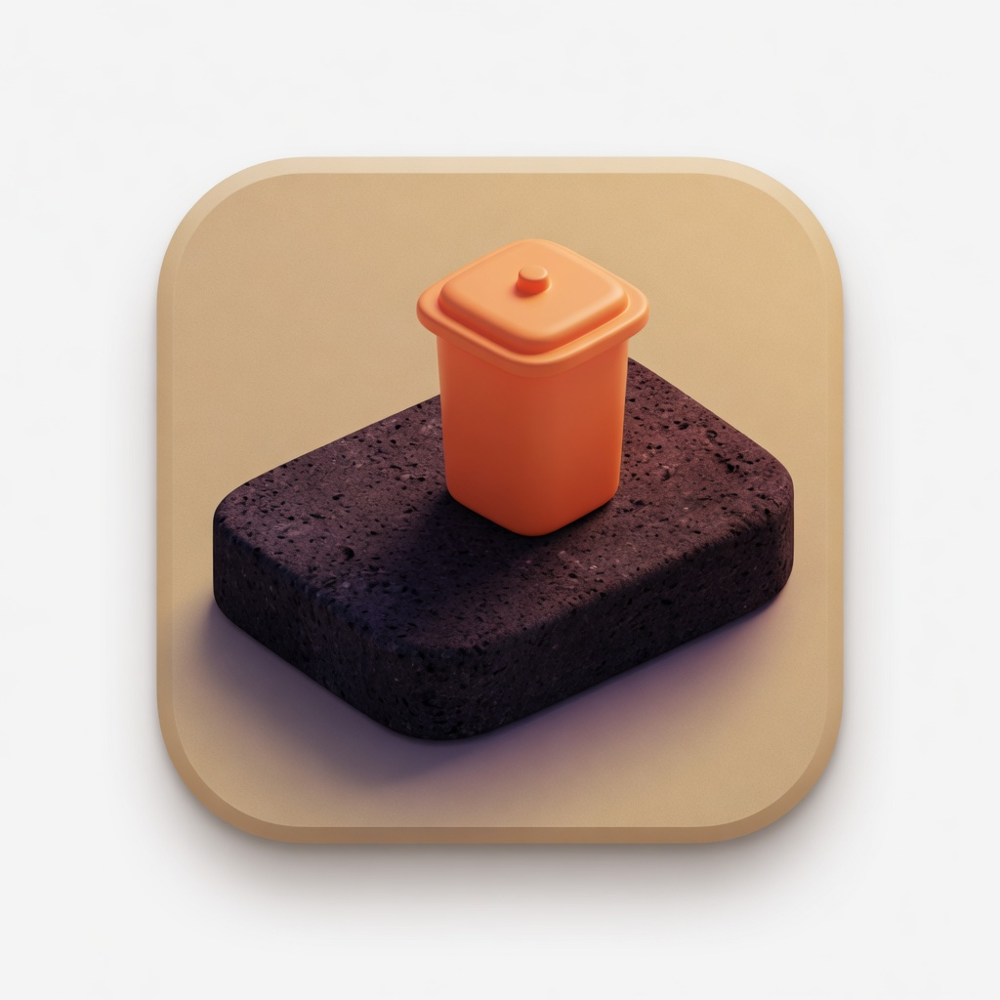
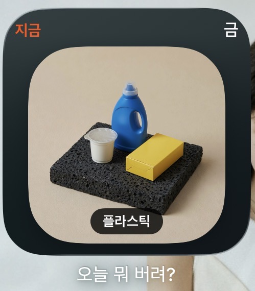
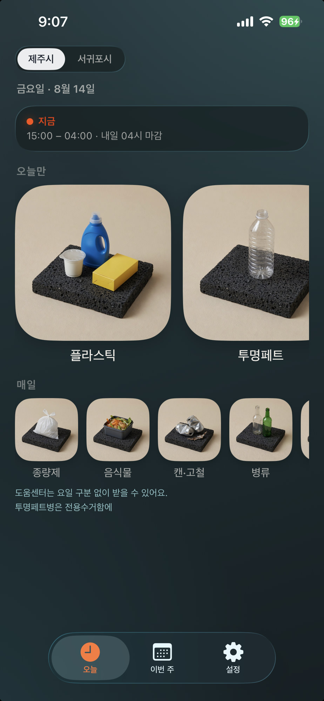
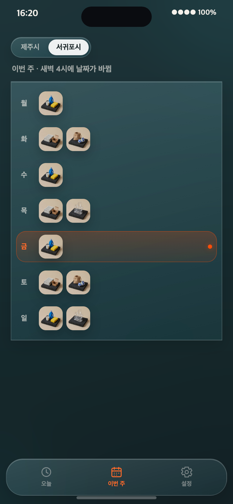

  

<h1 align="center">오늘 뭐 버려?</h1>

  제주 클린하우스 <strong>요일제</strong>를 홈 화면에서 바로 보는 아이폰 앱 
  <em>What can I throw out today?</em> — a widget-first Jeju household-waste schedule

  <a href="docs/INSTALL.md">설치</a> ·
  <a href="docs/design.md">설계</a> ·
  <a href="docs/mockups/">시안</a>

---

제주에 살면 문 앞이 아니라 **클린하우스**에 쓰레기를 가져갑니다. 재활용은 요일마다 받을 수 있는 종류가 다르고, 창구는 **그날 15:00부터 다음날 04:00**까지입니다. 자정만 보고 “토요일이니까 종이”라고 하면, 새벽 3시에는 아직 금요일입니다.

이 앱은 그 한 가지를 홈 화면 위젯으로 답합니다.  
**지금 이 시간, 내가 버릴 수 있는 쓰레기가 뭐지?**

앱스토어·계정·서버가 없습니다. 맥의 Xcode로 본인 아이폰에 올리면 되고, 설치 후에는 **오프라인**으로 동작합니다.

  
  
  

## 위젯

홈 화면에 **작은 · 중간 · 큰** 칸을 붙입니다. 스킴은 항상 **`jejuonl`** 로 앱을 설치한 뒤, 홈에서 위젯을 추가하세요. `jejuonlWidgetExtension` 스킴은 실행하지 않습니다.

- **작은 칸** — `지금 배출 가능` / `오늘 저녁부터`, 요일, 오늘 품목 사진과 이름 뱃지
- **중간 · 큰 칸** — 도시, 창 시간, 매일 품목. 큰 칸은 월–일 한눈에
- 위젯을 **길게 눌러** 제주시 / 서귀포시를 고릅니다. 이미 붙인 위젯은 앱에서 도시를 바꿔도 그대로입니다
- 배출일은 **Asia/Seoul 04:00**에 넘어갑니다. 달력 요일을 그대로 쓰지 않습니다

## 앱

- **오늘** — 창 상태, 오늘만 품목(큰 타일, 넘치면 가로로 밀기), 매일 품목
- 품목 사진을 누르면 **분리 안내 시트** — 큰 사진, 요일제/매일, 짧은 넣는 법·헷갈리는 것
- **이번 주** — 요일 줄. 줄을 누르면 그날 상세, 그 안 사진을 누르면 같은 안내 시트
- **설정** — 도시, 로컬 알림. 도시는 주황 테두리가 지금 고른 시
- 처음 설치하면 도시·알림·위젯 붙이는 법이 나옵니다. 이미 도시를 고른 뒤에는 다시 뜨지 않습니다

제주시만 **투명페트**를 요일 품목으로 따로 표시합니다. 서귀포는 공식 표 그대로 플라스틱만 적습니다.

## 하지 않는 일

지도, 가장 가까운 함 찾기, 계정, 포인트, 앱스토어 배포, 일정 자동 수집, 분리배출 백과사전.

제주시·서귀포시·클린제주의 **공식 앱이 아닙니다.** 일정은 공식 안내를 사람이 확인한 뒤 앱 안 JSON으로 넣습니다. 개소마다 창 시간이 다를 수 있습니다.

## 설치

자세한 순서는 **[docs/INSTALL.md](docs/INSTALL.md)** 입니다.

1. 맥에 Xcode, 아이폰에 개발자 모드
2. `jejuonl/jejuonl.xcodeproj` 를 열고 스킴 **`jejuonl`** (위젯 스킴 아님)
3. 앱과 위젯 타깃에 **같은 Team** → ▶ Run
4. 홈 화면 빈 곳을 길게 → `오늘 뭐 버려?` 위젯 추가
5. 위젯을 길게 눌러 제주시 / 서귀포시 선택

무료 Apple ID면 약 **7일마다** Xcode로 다시 설치해야 합니다.  
알림을 쓰려면 **일주일에 한 번은** 앱을 여세요.

## 일정 데이터

번들 파일 `Shared/jejuonlCore/Resources/schedule_v1.json`  
확인일·출처는 파일 안과 설정 화면에 있습니다. 정책이 바뀌면 JSON과 버전만 고치면 됩니다.

계산은 `ScheduleEngine` 한곳입니다. 뷰·위젯·알림이 요일표를 제각각 갖지 않습니다.

## 문서

| 문서 | 내용 |
| --- | --- |
| [docs/INSTALL.md](docs/INSTALL.md) | 비개발자 설치 |
| [docs/design.md](docs/design.md) | 잠긴 설계 |
| [docs/mockups/](docs/mockups/) | GUI 시안 HTML·PNG |
| [docs/PROGRESS.md](docs/PROGRESS.md) | 페이즈·개선 기록 |

## 면책

배출 가능 여부는 시청·클린하우스 현장 안내가 우선입니다. 이 앱을 믿고 무단 투기하지 마세요. 요일제 폐지·상시 배출 시범은 아직 유동적입니다.

## License

[MIT](LICENSE)
