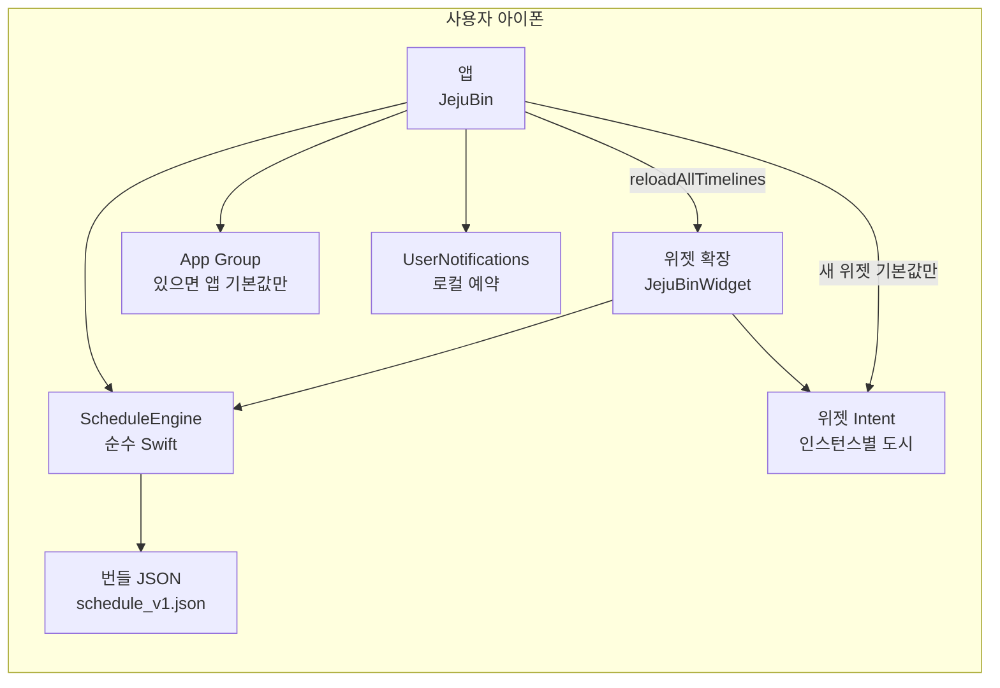
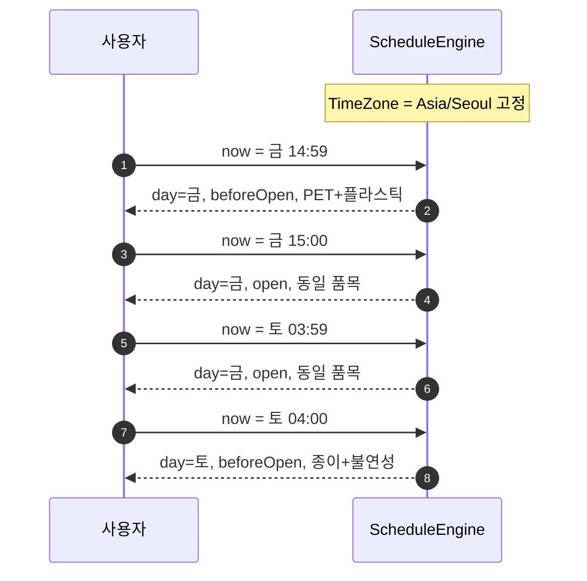

# 오늘 뭐 버려? (JejuBin) — 설계서

| 항목 | 값 |
| --- | --- |
| 문서 제목 | 제주 클린하우스 요일제 홈 화면 위젯 |
| 제품 가칭 | 오늘 뭐 버려? / JejuBin |
| 작성 | [Author] |
| 날짜 | 2026-08-13 |
| 상태 | Approved (user decisions 2026-08-13) |
| 대상 독자 | 구현을 맡을 iOS 엔지니어·코딩 에이전트, 그리고 제품 결정을 내릴 비개발 사용자 |
| 워크스페이스 | `/Users/meeeeca_m4/claude/Grok_project/jeju_project` (그린필드, 코드 없음) |

이 문서는 v1을 구현하기에 충분할 만큼 구체적이다. 제품 질문은 `## Resolved Decisions`에서 2026-08-13에 닫혔다. 구현자는 그 결정을 다시 묻지 않는다. 용어 옆에 한 줄 풀이를 붙인 이유는, 위젯·프로비저닝 같은 단어를 제품 소유자도 읽을 수 있게 하기 위함이다.

---

## Overview

제주에 잠시 사는 사람은 클린하우스(집 앞이 아니라 동네 배출함)에 쓰레기를 가져가야 하고, 재활용품은 **요일마다 받을 수 있는 종류가 다르다**. 달력 요일만 보면 틀리기 쉽다. 배출 창구는 **당일 15:00부터 다음날 04:00까지**이고, 자정~04:00은 달력상 다음날이지만 아직 **어제 배출일**이다.

v1은 계정·서버·앱스토어 없이, 본인 아이폰에 **무료 Apple ID + Xcode**로 올리는 **위젯 우선** 앱이다. 사용자는 서귀포시에 살면서 제주시에도 간다. 홈 화면 위젯(Small·Medium·Large)마다 도시를 길게 눌러 바꿀 수 있고, 앱 헤더에서도 두 시를 바로 바꾼다. 원할 때만 로컬 알림이 창구 열리기 전에 알려 준다. 일정 데이터는 버전 있는 JSON과 순수 Swift `ScheduleEngine`이 한곳에서 계산한다.

---

## Background & Motivation

### 현재 상태

워크스페이스는 비어 있다. 백엔드, 계정, 기존 코드가 없다. 사용자는 개발자가 아니며 Grok Build도 처음이다. 구현은 이후 오케스트레이터가 코딩 서브에이전트에 나눠 맡긴다. 그래서 이 문서는 “아이디어”가 아니라 **파일 경로·타입·테스트 시각·카피·설치 순서**까지 적는다.

### 왜 앱이 필요한가

- 육지 요일제 앱은 **문전 수거**와 다른 품목·시간대를 전제로 한다. 제주 클린하우스 규칙과 맞지 않는다.
- 제주시와 서귀포시 규칙이 **같다 / 비슷하다**가 아니다. 제주시는 투명페트병을 요일 제한 품목으로 따로 적고, 서귀포 공식 안내는 플라스틱만 적는다.
- 자정에 요일이 바뀌면 “토요일이니까 종이”라고 착각하고, 새벽 3시에 금요일 플라스틱을 못 버리는 줄 안다. 반대 실수도 난다.
- 정책이 흔들리고 있다. 2026-07-26 연합뉴스 등: 신임 지사가 요일제 폐지를 공약했고, **상시 배출 시범운영은 논의 중이며 미결정**. 하드코딩하면 고치기 어렵다.

### 사용자 고통

한 가지 질문만 반복한다. **“지금 이 시간, 내가 버릴 수 있는 쓰레기가 뭐지?”** 주간표를 외우거나 시청 페이지를 여는 것은 답이 아니다.

---

## Goals & Non-Goals

### Goals (v1)

1. 아이폰 홈 화면 **Small + Medium + Large 위젯**에서 배출일 기준 제한 품목을 한눈에 본다. Large는 오늘 카드 + 이번 주 7행.
2. 앱·위젯에서 **제주시 ↔ 서귀포시를 바로 바꾼다**(온보딩 한 번으로 끝이 아님). 앱은 알림 설정, 위젯 추가 안내, 오늘 상세 + 주간 달력도 한다.
3. **오프라인 우선**. 설치 후 네트워크·계정 불필요.
4. 배출일(discharge day)은 **Asia/Seoul 04:00에 넘어간다**. `Calendar.current` 요일을 그대로 쓰지 않는다.
5. 일정은 번들 JSON. 정책 변경 시 JSON과 `catalogVersion`만 고친다.
6. 알림은 `UNUserNotificationCenter` 로컬만. 기본값 매일 14:30.
7. 본인 기기 사이드로드(Xcode). 스냅샷 태그로 단계마다 되돌릴 수 있다.
8. 접근성: Dynamic Type, 한국어 VoiceOver, 색만으로 구분하지 않음.

### Non-Goals (v1에서 만들지 않음)

- App Store / TestFlight / IAP / 개인정보 영양 라벨
- 클린하우스 지도·GPS·가장 가까운 함 찾기
- 계정, 소셜, 포인트, 자원회수 보상제
- Android
- Live Activity / Dynamic Island
- 공식 일정 자동 스크래핑
- 멀티 유저 / 가족 공유
- 음식물 RFID / 교통카드 연동
- 대형폐기물·영농폐기물·슬레이트 등 특수 품목 예약
- 제3자 분석, CloudKit, 푸시 서버
- 위젯 얼굴 위 칩을 탭해 도시가 뒤집히는 **대화형 토글**(v1은 Configuration Intent + 앱 헤더만)
- 유료 Apple Developer 계정·App Groups를 전제로 한 기능

---

## Key Decisions

1. **위젯 우선, 앱은 설정 껍데기.**  
   매일 여는 화면이 아니라 홈 화면 한 칸이 제품이다. 앱 정보 구조는 위젯을 설명·설정하는 쪽으로 맞춘다.

2. **배출일(discharge day)은 04:00에 롤한다. 창 상태는 2값이다.**  
   `beforeOpen` = 04:00 포함 ~ 15:00 미만. `open` = 15:00 포함 ~ 다음날 04:00 미만.  
   달력 아침 04:00 이후를 `.afterClose`로 두지 않는다. 그 시각에 이미 새 배출일이 시작되므로 “어제 마감”과 “오늘 열리기 전”은 같은 구간이다. 카피만 “창구 마감 · 오늘 저녁 15:00부터”로 쓴다.

3. **일정은 버전 있는 로컬 JSON, 계산은 순수 `ScheduleEngine`.**  
   뷰·위젯·알림이 요일 배열을 제각각 갖지 않는다. 엔진은 `(city, now)` → 스냅샷. 타임존은 기기 설정이 아니라 항상 `Asia/Seoul`.

4. **제주시 / 서귀포시를 카탈로그에서 분리한다.**  
   투명페트병은 제주시만 제한 품목으로 표시한다. 서귀포는 공식 표에 플라스틱만 있으므로 추측으로 PET 칩을 넣지 않는다.

5. **최소 OS는 iOS 17.0.**  
   사용자 기기가 최신 아이폰이고, WidgetKit 타임라인·`AppIntent`/`WidgetConfigurationIntent`가 iOS 17에서 안정적이다. 위젯 **얼굴**은 탭하면 앱이 열린다. 도시 전환은 위젯을 길게 눌러 Edit하는 Configuration Intent다. 얼굴 위 대화형 도시 토글 버튼은 v1 비목표. iOS 16 하위 호환은 범위 밖.

6. **위젯 도시는 Configuration Intent가 1급 소스다. App Groups는 최선 노력(best-effort). 외부 SPM 없음.**  
   계정·CloudKit·분석 SDK를 넣지 않는다. 코어는 로컬 Swift 소스를 앱·위젯·테스트 타깃이 같이 컴파일한다.  
   각 위젯 인스턴스는 `TodayWidgetConfigIntent.city`를 가진다. 위젯 타임라인은 **이 값만**으로 `ScheduleEngine`을 돌린다. `containerURL`이 nil이어도 위젯은 도시를 보여 준다.  
   페이즈 1에서 App Groups를 **시도**하고 결과를 `PROGRESS.md`에 적는다. 성공하면 앱이 바꾼 도시를 공유 기본값으로 써 **새로 붙인** 위젯 Intent 기본값에 쓸 수 있다. **이미 붙어 있는** 위젯 인스턴스는 자기 Intent 도시를 유지한다.  
   `UserDefaults(suiteName:)` 비-nil은 공유 증거가 아니다. 컨테이너가 없으면 앱은 표준 `UserDefaults`에 도시를 저장한다. 크래시 금지.

7. **알림은 로컬, 현재 배출일부터 7일을 미리 깐다.**  
   푸시 서버가 없다. 트리거는 `UNCalendarNotificationTrigger`, `DateComponents.timeZone = Asia/Seoul`, `repeats: false`. 도시/설정/타임존/앱 포그라운드 때마다 다시 스케줄한다. 제한 품목과 구독 품목이 안 겹치면 그날 알림은 넣지 않는다(매일 품목만 있는 날은 기본 조용). 반복 트리거는 쓰지 않는다(대안 H).

8. **배포는 무료 Apple ID로 개인 기기만. 스토어·유료 ADP는 v1 전제가 아니다.**  
   사용자는 무료 Apple ID만 쓴다. 약 7일마다 Xcode로 다시 설치하는 것과 Personal Team의 App Groups 거절을 **감수**한다. 제품은 App Groups 없이 동작해야 한다(위젯 Intent + 앱 표준 UserDefaults). 유료 ADP를 권하거나 게이트로 막지 않는다.

9. **Git 스냅샷 = 페이즈 = PR 단위.**  
   브랜치는 `main` 하나여도, 페이즈가 끝날 때마다 커밋 + 주석 태그 `snapshot/phase-N-name`.

10. **표시 이름은 「오늘 뭐 버려?」로 잠겼다.**  
    번들 ID / 모듈명은 ASCII `JejuBin` / `kr.jejubin.app`. 바꾸지 않는다.

11. **이중 도시가 v1 기능이다. 집 = 서귀포시.**  
    온보딩은 집 도시를 고른다(서귀포시 카드 강조, 탭으로 확정). 그 값이 앱 현재 도시와 **새** 위젯 Intent 기본값을 심는다. 이후 전환은 앱 헤더 세그먼트와 위젯 Edit이다. 시뮬레이터/Preview 기본 도시도 서귀포시.

---

## 서비스 개념

한 일 제품: **지금 이 시간, 내가 버릴 수 있는 쓰레기가 뭐지?**

| 표면 | 역할 |
| --- | --- |
| 홈 화면 위젯 | 주 인터페이스. 인스턴스마다 도시(Configuration Intent). 창 상태 + 그 시의 제한 품목. Small·Medium·Large. |
| 앱 | 헤더에서 도시 전환, 알림, 위젯 추가 방법, 오늘 상세, 주간 보기. |
| 알림 | 선택. 앱의 **현재 도시** 기준. 창 열리기 전 14:30, 저녁 20:00(선택). |
| 데이터 | 기기 안. 설치 후 오프라인. |

의도적으로 하지 않는 일: 분리배출 백과사전, 지도, 보상, 소셜. 헷갈리는 품목(과일 씨·뼈는 음식물 아님)은 오늘 상세에 **짧은 주석 한 줄**만 두고, 사전 앱으로 키우지 않는다.

---

## 제주 도메인 규칙 (검증 2026-08-13)

제주는 육지식 문전 수거가 아니라 **클린하우스 배출**이다. 재활용은 **요일별 배출제**.

### 배출 창구 (UX 핵심)

| 대상 | 시간 | 비고 |
| --- | --- | --- |
| 클린하우스 일반·재활용 | 15:00 ~ 익일 04:00 | 종량제·캔·병·스티로폼·요일제 품목. 자정 넘어 04:00 전까지는 **전날 배출일** |
| 음식물 | 24시간 | **유일하게** 창 상태와 무관. “언제든”은 음식물의 전유 |
| 재활용도움센터 | 요일 제한 없음 | 서귀포 공식: 06:00–22:00 (음식물 24시간). 제주시는 흔히 06:00–24:00로 안내되나 개소마다 다를 수 있어 **시간을 위젯에 단정하지 않는다**. |

**서귀포 창 시간 가정 (v1):** 클린제주 서귀포 블록은 “개소별 데이터 기준”만 적고 15:00–04:00을 인쇄하지 않는다. 제주시 공식 안내와 도 단위 보도(연합뉴스 등)가 섬 공통 15:00–04:00을 쓰므로, 카탈로그 `window`는 **양 시 동일**하다. 개소 예외(더 짧거나 긴 함)는 v1 비범위. 설정 화면에 한 줄로 밝힌다.

### 매일 배출 (양 시 공통)

종량제(일반/가연성), 음식물, 캔·고철, 병류, 스티로폼.  
매일 = **요일 제한이 없다**는 뜻이지 24시간은 아니다. 음식물만 24시간이고, 나머지 매일 품목도 클린하우스에서는 15:00–04:00이다.

### 제주시 (시행 2025-06-06, 규칙 확인일 2026-07-13)

출처: [클린제주 가이드](https://jejucleanhouse.com/guide), [제주시 요일별 배출안내](https://www.jejusi.go.kr/field/eco/weekwaste.do)

| 배출 요일 | 제한 품목 |
| --- | --- |
| 월 | 플라스틱, 투명페트병 |
| 화 | 종이류, 불연성(마대) |
| 수 | 플라스틱, 투명페트병 |
| 목 | 종이류, 비닐류 |
| 금 | 플라스틱, 투명페트병 |
| 토 | 종이류, 불연성(마대) |
| 일 | 플라스틱, 투명페트병, 비닐류 |

투명페트병은 **전용수거함**에 별도 배출. 라벨은 비닐류.

제주시 공식 페이지의 다른 표기(월·수·금·일 플라스틱+PET / 화·목·토 종이 / 화·토 불연성 / 목·일 비닐)는 위 표와 동치다. 카탈로그는 **요일 → 품목 배열**로 저장해 두 표기를 한곳에서 검증한다.

### 서귀포시 (시행 2025-06-06)

출처: [클린제주 가이드](https://jejucleanhouse.com/guide), [서귀포시 생활쓰레기 안내](https://www.seogwipo.go.kr/recycle/index.htm)

같은 요일 패턴이지만 **투명페트병을 별도 목록 품목으로 두지 않는다**(플라스틱만).

| 배출 요일 | 제한 품목 |
| --- | --- |
| 월 / 수 / 금 | 플라스틱 |
| 화 / 토 | 종이류, 불연성(마대) |
| 목 | 종이류, 비닐류 |
| 일 | 플라스틱, 비닐류 |

투명페트 **칩은 넣지 않는다**. 오늘 상세 하단에만 선택 주석: “투명페트는 전용함 또는 도움센터를 확인하세요.” (요일 칩으로 승격하지 않음.)

### 재활용도움센터

요일 제한 없음. v1은 지도 없이, 오늘 상세 하단에 한 줄: “도움센터는 요일 구분 없이 받을 수 있어요.” 제주시 운영시간을 위젯에 적지 않는다(개소별 상이, 1차 출처 불충분).

### 정책 리스크

2026-07-26 연합뉴스(AKR20260724148200056) 등: 요일제 폐지 공약, **상시 배출 시범운영은 지역·시기 미정**. 2026-08-11 보도: 연구용역 예산 확보, 시범은 논의 중.  
→ 일정은 로컬 버전 JSON. 뷰에 매직 넘버 금지. 180일 이상 된 카탈로그는 앱에서 “일정이 오래됐습니다” 배너.

---

## UX 흐름 (와이어 수준)

화면 문장은 모두 한국어. 영어 디버그 문자열을 UI에 남기지 않는다.

### 정보 우선순위 (전 화면 공통)

1. **지금 창이 열려 있는가** (지금 배출 가능 / 오늘 저녁부터)
2. **제한 품목** (플라스틱·종이·비닐·불연성·투명페트)
3. 배출 요일 이름 + 창 시간 `15:00–04:00`
4. 매일 품목은 2선 (작게, 또는 “매일” 한 줄)
5. 도시 이름

색만으로 품목을 구분하지 않는다. 칩 = **도형 + 한글 라벨 + SF Symbol**.

### 1) 첫 실행 / 온보딩

`OnboardingView` 풀스크린은 **페이즈 6**에서만 켠다. 페이즈 3–5는 `AppSettings.default.hasCompletedOnboarding == true`라서 탭 루트로 바로 들어간다. 페이즈 6은 **신규 설치**(저장된 `settings.v1` 없음)에만 기본값을 `false`로 바꾼다. 이미 도시를 고른 기존 설정을 지우거나 온보딩을 다시 띄우지 않는다.

페이즈 6 이후: `hasCompletedOnboarding == false`이면 탭 루트가 아니라 `OnboardingView` 풀스크린.

```
[1/3 도시]
┌─────────────────────────────┐
│  오늘 뭐 버려?              │
│  지금 주로 어디에 사나요?    │
│  나중에 위젯·앱에서          │
│  제주시로 바로 바꿀 수 있어요 │
│                             │
│  ┌─────────┐ ┌ 강조 ───┐    │
│  │ 제주시  │ │서귀포시 │    │  ← 서귀포 카드 테두리 hallabong
│  │ PET 구분│ │집(추천) │    │     그래도 탭해야 다음 활성
│  └─────────┘ └─────────┘    │
│                             │
│         [다음]               │
└─────────────────────────────┘
```

- 한 도시를 탭해 집 도시로 확정. **서귀포시 카드를 시각적으로 강조**하지만 미리 선택된 것으로 저장하지 않는다. 다음 버튼은 탭 후에만 활성.
- 카드 하단: 제주시 “투명페트 전용함 요일제”, 서귀포시 “공식 안내는 플라스틱으로 표기”.
- 안내 한 줄: “다른 시에 가면 홈 화면 위젯을 길게 눌러 도시를 바꾸세요.”

```
[2/3 알림]
┌─────────────────────────────┐
│  창구 열리기 전에 알려줄까요? │
│                             │
│  기본: 매일 오후 2:30        │
│  오늘 요일제 품목만 알려요.  │
│  나중에 설정에서 끌 수 있어요 │
│                             │
│  [알림 받기]  [나중에]       │
└─────────────────────────────┘
```

- [알림 받기] → `UNUserNotificationCenter.requestAuthorization([.alert, .sound])`. 허용이면 기본 프리셋 저장 후 7일 스케줄. 거부여도 온보딩은 진행.
- [나중에] → `notifications.isEnabled = false`. 시스템 팝업을 띄우지 않음.

```
[3/3 위젯 추가]
┌─────────────────────────────┐
│  홈 화면에 붙이는 법          │
│                             │
│  1  빈 화면을 길게 누른다     │
│  2  왼쪽 위 + 를 누른다      │
│  3  「오늘 뭐 버려?」검색     │
│     작은·넓은·큰 칸          │
│  4  위젯을 길게 눌러         │
│     제주시/서귀포시 고르기    │
│                             │
│  (세 단계 정적 일러스트)     │
│                             │
│  [시작하기]                  │
└─────────────────────────────┘
```

iOS는 앱이 위젯을 대신 붙일 수 없다. 코치는 정직하게 수동 추가만 안내한다. [시작하기] → `hasCompletedOnboarding = true`, 오늘 화면.

재온보딩은 없다. 도시 전환은 앱 헤더와 위젯 Edit. 설정의 도시 행은 헤더와 같은 `appCity`를 바꾼다.

### 2) 앱 — 오늘 / 이번 주 / 설정

탭 3개.

**오늘 (`TodayView`)**

```
┌─────────────────────────────────┐
│ [제주시] [서귀포시]             │  ← 세그먼트만. 선택 = appCity. 설정 톱니는 하단 탭.
│ 금요일 · 8월 14일               │  ← dischargeDayStart (달력 now 아님)
│                                 │
│ ┌ 상태 카드 ─────────────────┐  │
│ │ 지금 배출 가능              │  │  ← open
│ │ 창구 내일 04:00에 닫혀요     │  │
│ │ 15:00 – 04:00               │  │
│ └────────────────────────────┘  │
│                                 │
│ 오늘만 되는 것                   │
│ [플라스틱]                       │
│                                 │
│ 매일                             │
│ [종량제][음식물][캔·고철]        │
│ [병류][스티로폼]                 │
│                                 │
│ 도움센터는 요일 구분 없이…       │
│ (서귀포) 투명페트는 전용함·도움   │
│ 센터를 확인하세요.               │
└─────────────────────────────────┘
```

헤더 `요일 · M월 d일`의 날짜 소스는 **`snapshot.dischargeDayStart`** 이다. `Date.now`의 달력 요일/날짜를 쓰지 않는다. 포맷: `Locale(identifier: "ko_KR")` + `Asia/Seoul` (`EEEE` 대신 짧은 요일 또는 `금요일` 고정 한글 맵 + `M월 d일`).  
예: 달력 토요일 03:59 → 헤더 **금요일 · 8월 14일**, 칩은 금요일 품목 (E3). 와이어의 날짜는 예시일 뿐이며 2026-08-13(목)을 수요일로 착각한 것이 아니다.

`appCity == nil`이면(페이즈 3·온보딩 전) 오늘 본문 대신 ONB-1과 같은 도시 두 카드(서귀포 강조)만 보여 준다. 탭 바는 유지. Preview/시뮬레이터는 `CityID.seogwipo`를 심어 와이어를 그린다.

헤더 세그먼트를 바꾸면 `appCity`를 즉시 저장하고 오늘·이번 주·알림 스케줄을 그 시 기준으로 다시 그린다. 위젯 인스턴스 도시는 바꾸지 않는다(Intent가 소스). App Groups가 있으면 공유 기본값만 갱신해 **이후 새로 붙는** 위젯의 Intent 기본값에 쓴다.

`beforeOpen` 상태 카드:

```
│ 오늘 저녁부터                    │
│ 15:00에 열려요 · 앞으로 2시간 11분│
│ 지금은 음식물만 24시간            │
```

04:00 직후(새 배출일 `beforeOpen`)도 같은 레이아웃. 부제만 “방금 창구가 닫혔어요”를 04:00–04:30 사이에 쓸 수 있다. 별도 상태 값은 만들지 않는다.

카운트다운: `nextWindowToggle - now`를 **초를 버리고 분 단위로 내림** (`Int(interval / 60)`). 표시:

- `h == 0` → `앞으로 M분` (예: `앞으로 11분`)
- `h >= 1` → `앞으로 H시간 M분` (예: `앞으로 2시간 11분`, `앞으로 1시간 0분`)
- 0분 미만은 다음 스냅샷이 오면 사라진다. 초 단위·“분 버림” 혼용 금지.

타임존은 표시도 `Asia/Seoul`. 헤더에는 도시 세그먼트만 둔다. 설정 톱니를 헤더에 또 두면 하단 탭과 중복이므로 **넣지 않는다.**

**이번 주 (`WeekView`)**

```
┌─────────────────────────────────┐
│ 이번 주 · 제주시                │
│ 배출일은 새벽 4시에 바뀝니다      │
│                                 │
│ 월  ● 플라스틱  PET              │
│ 화    종이  불연성               │
│ 수    플라스틱  PET              │
│ 목    종이  비닐                 │
│ 금  ← 오늘(배출일)               │
│     플라스틱  PET                │
│ 토    종이  불연성               │
│ 일    플라스틱  PET  비닐        │
└─────────────────────────────────┘
```

- 7행은 **월요일 시작** 고정. `Calendar.firstWeekday`로 주 시작을 바꾸지 않는다.
- **어느 월–일인가:** `ScheduleEngine.week(city:containing:)`는 raw `now`가 아니라 **`dischargeDayStart`가 속한 월–일**을 돌려준다. 월 02:00(아직 일요일 배출일, E8/E10)에는 *지난* 달력 주(일요일이 들어 있는 주)가 보이고, 일요일 행이 “오늘(배출일)”이다. 달력상 이번 주 월요일 행을 강조하지 않는다.
- 매일 품목은 헤더 한 줄로만. 행마다 반복하지 않음.
- 행 탭 → 그 배출일 기준 상세 시트(위젯과 같은 칩 + 창 시간).
- 각 행의 스냅샷 `now`는 그 배출일 **15:00** (창이 열린 상태의 품목 = 그날 제한 품목). 하이라이트만 `dischargeDayStart`와 같은 행.

**설정 (`SettingsView`)** — 화면 목록은 아래 Screen inventory.

### 3) 위젯 상태

위젯은 앱을 열지 않아도 의미가 있어야 한다. **얼굴 탭 → 앱 `TodayView`**. 도시 전환은 얼굴을 탭하는 것이 아니라:

1. 위젯을 길게 누른다  
2. 위젯 편집 / Edit Widget  
3. 도시: 제주시 | 서귀포시 (`TodayWidgetConfigIntent`)

이 경로가 v1의 “위젯에서 시 바꾸기”이며 **App Groups가 없어도** 동작한다. 얼굴 위 칩을 탭해 시를 뒤집는 버튼은 만들지 않는다.

각 인스턴스는 자기 `city`를 가진다. 홈에 위젯 두 개(서귀포 + 제주)를 붙여 두고 오갈 수 있다. 기본 Intent 값 = 앱 `appCity`(공유가 있을 때) 또는 `seogwipo`.

품목·PET 주석·알림 카피는 **그 표면이 고른 시**를 따른다. 위젯은 Intent 시, 앱·알림은 `appCity`.

#### Small (`systemSmall`)

제한 품목만. 매일 품목은 넣지 않는다. 카탈로그 최댓값 = 제주시 일요일 3개.

**개수별 레이아웃 (v1 확정)**

| 제한 품목 수 | 얼굴 | 글자 |
| --- | --- | --- |
| 1 | 아이콘 하나, 크게 | 아이콘 **하단과 겹치는** 어두운 뱃지 (`플라스틱`). 아이콘 아래 별도 캡션 금지 |
| 2 | 두 아이콘을 살짝 겹친 팬. 비중 동일 | 뱃지 없음. VoiceOver만 두 이름 |
| 3 | 세 아이콘 팬. 비중 동일 | 우하단 한라봉 숫자 뱃지 `3`. 이름을 욱여넣지 않음 |

1개를 히어로로 키우고 나머지를 “외 2”로 숨기지 않는다. 작은 칸의 질문은 “오늘 뭘 버릴 수 있나”라서 2–3개를 동등하게 보여 준다.

1행은 상태 필 + 배출 요일 (`지금 · 금` / `저녁부터 · 금`). 하단 시간 줄은 뺀다(칸이 아이콘에 간다).

`catalogStale`은 위젯에 배너 없음. 오늘 화면만.

#### Medium (`systemMedium`)

```
┌────────────────────────────────────┐
│ 지금 배출 가능          제주시  금 │
│ 내일 04:00에 닫혀요                │
│                                    │
│ [플라스틱] [투명페트]              │
│                                    │
│ 매일  종량제 · 음식물 · 캔 · 병 · 스티로 │
└────────────────────────────────────┘
```

매일 줄은 **짧은 라벨**을 쓴다: 종량제 · 음식물 · 캔 · 병 · 스티로 (`WasteItem.shortKoreanName`). “스”에서 자르지 않는다. Dynamic Type이 커 한 줄이 안 되면 `.minimumScaleFactor(0.8)` 후 줄바꿈.

`beforeOpen`: 좌측 큰 문장 “오늘 저녁부터”, 우측 또는 하단 “15:00 시작”.

#### Large (`systemLarge`, **v1 필수**)

위: 오늘 히어로(큰 아이콘 1–3 + 마감 시각 + 매일 아이콘 줄).  
아래: **월–일 7열** (요일 글자 + 그 날 대표 아이콘 1개). 오늘은 한라봉 칸.  
맨 아래 한 줄: `내일 종이 · 불연성` (`nextRestrictedChange`의 다음 배출일 제한 품목).

7행 리스트는 쓰지 않는다(횡해 보임). 한 날에 품목이 둘이면 열에는 **첫 제한 품목만** 두고, 오늘 히어로에서 전부 보여 준다.

#### 위젯이 보여서는 안 되는 것

- 달력 요일만 보고 계산한 품목
- 자정에 갑자기 다음날 품목으로  Flip
- 색점만 있는 범례
- “로딩 중” 스피너(오프라인 로컬 계산)

### 4) 알림 설정 UX

```
알림
  [=======● ] 알림 켜기

  창 열리기 전
    시간    14:30          ← DatePicker .hourAndMinute
    허용 04:00–14:59       ← 범위 밖은 클램프 (15:00 이후는 창이 이미 열림)

  창 열린 뒤 (선택)
    [  ] 저녁에도 한 번 더
    시간    20:00          ← 허용 17:00–23:30

  알려줄 품목
    [x] 플라스틱
    [x] 투명페트병     ← 서귀포면 숨기거나 비활성 + “제주시만”
    [x] 종이류
    [x] 비닐류
    [x] 불연성
    [ ] 매일 품목도 포함   ← 기본 꺼짐
```

**조용한 날:** 그날 제한 품목 ∩ 구독 품목이 공집합이면 알림 request를 만들지 않는다. “매일 품목도 포함”이 켜져 있을 때만 제한 없는 날에도 14:30 알림(“오늘은 매일 품목만 클린하우스에 넣을 수 있어요”).

SET-2 마스터를 켤 때 권한 분기 (`UNAuthorizationStatus`만, 다른 케이스를 거절에 묶지 않음):

- `.notDetermined` → `requestAuthorization([.alert, .sound])`. 허용이면 저장+reschedule, 거절이면 마스터를 다시 off + 배너.
- `.denied` → 마스터를 on으로 두지 않고 배너 “설정 앱에서 알림을 켜 주세요” + `UIApplication.openSettingsURLString`.
- `.authorized` 또는 `.ephemeral` → 저장 + `reschedule`.
- `.provisional` → **거절이 아니다**(조용한 전달 허용). 이 앱은 provisional을 요청하지 않는다. 만에 하나 이 값이면 `.authorized`와 같이 저장+reschedule. `case .denied, .provisional`로 묶지 말 것.

앱 실행(`JejuBinApp.init` 또는 `AppDelegate`)에서 카테고리 `JEJUBIN_REMIND`를 한 번 등록한다.

### 5) 빈 화면 / 권한 / 오래된 일정

| 상태 | 위치 | 내용 |
| --- | --- | --- |
| 앱 `appCity == nil` | 오늘 | ONB-1과 같은 도시 피커(서귀포 강조) |
| 위젯 placeholder | 위젯 | `TodayLoad.cityMissing` 또는 기본 서귀포. App Group 유무와 무관 |
| 권한 거부 | SET-2·오늘 배너 | 시스템 설정으로 이동 |
| 카탈로그 파싱 실패 | 오늘 + 위젯 | `TodayLoad.parseFailed` → “앱을 다시 설치해 주세요” (번들 손상. 앱을 연다고 고쳐지지 않음) |
| `schemaVersion` > 앱이 아는 값 | 오늘 + 위젯 | `TodayLoad.schemaTooNew` → “앱을 업데이트하세요” |
| `verifiedAt` + 180일 | **오늘 배너만** | `ready(..., catalogStale: true)`. “일정이 180일 전 확인분입니다. 시청 안내를 한 번 보세요.” 위젯은 기존 계산 유지 |
| 알림 스케줄 0건인데 마스터 온 | 설정 | “다시 예약” 버튼 → `NotificationScheduler.reschedule(settings:now:)` |

### 6) 접근성

- 모든 칩·상태 필은 `accessibilityLabel` 한국어 문장. 예: “플라스틱, 오늘 저녁 세 시부터 배출 가능”.
- Dynamic Type: Small 위젯은 `.caption`~`.headline` 범위에서 줄바꿈. 큰 글씨에서 칩이 잘리면 라벨 우선, 심볼 축소.
- 대비: 배경 `sand` `#F6F1E8` 위 본문 `basalt` `#1C2430`. 상태 필·버튼 채움은 `hallabong` `#E26A2C`. 모래 위 **작은 주황 글자**가 필요할 때만 대비 검증된 형제 `hallabongInk` `#C35312`를 쓴다. 본문 잉크를 `#C35312`로 바꾸지 않는다. 상태 필은 텍스트 + 아이콘.
- Reduce Motion: 카운트다운은 숫자만, 펄스 애니메이션 없음.
- 색각: 품목 도형을 다르게 (플라스틱 둥근 사각, PET 물병, 종이 접힌 면, 비닐 물결 사각, 불연성 마대).

---

## 알림 서비스 설계

**로컬만.** `UNUserNotificationCenter`. 푸시 서버·CloudKit·FCM 없음.

용어: 로컬 알림 = 아이폰이 스스로 예약해 띄우는 알림. 인터넷이 꺼져 있어도 동작.

### 기본값

| 키 | 기본 |
| --- | --- |
| 마스터 | 온보딩에서 허용한 경우만 true |
| 사전 알림 | 매일 14:30 (창 30분 전) |
| 저녁 알림 | off, 프리셋 20:00 |
| 구독 품목 | 제한 5종 전부 (서귀포는 PET 제외) |
| 매일 품목 포함 | false |

### 식별자

```
jejubin.preopen.{yyyy-MM-dd}     // 배출일 기준 날짜
jejubin.evening.{yyyy-MM-dd}
```

카테고리 `JEJUBIN_REMIND`. 액션 `OPEN_TODAY`(앱 열기). 삭제 시 재스케줄하지 않음(그날 skip).

### 스케줄 알고리즘

시그니처는 코드 계약과 같다: `NotificationScheduler.reschedule(settings:now:)`. 카탈로그는 `engine`이 이미 들고 있다.

**트리거 (필수):** `UNCalendarNotificationTrigger(dateMatching:repeats:)`

- `DateComponents`: `calendar = SeoulCalendar.make()`, `timeZone = Asia/Seoul`, `year` / `month` / `day` / `hour` / `minute`를 모두 채운다. `repeats: false`.
- `dateComponents.timeZone`을 빼면 기기 로컬 14:30에 뜬다. 금지.
- `UNTimeIntervalNotificationTrigger`는 쓰지 않는다(기기 꺼짐·재부팅 경계에서 달력 트리거가 더 단순).

**배출일 7개:** `D0 = engine.snapshot(..., now).dischargeDayStart` (오늘 배출일의 서울 자정). `D1...D6 = calendar.date(byAdding: .day, value: 1...6, to: D0)`. 달력 자정 `now`가 아니라 **현재 배출일부터**다. 월 02:00이면 D0은 일요일.

각 배출일 D:

1. `preOpenTime`을 **04:00–14:59로 클램프**. 15:00 이후·03:59 이전 값은 저장 시에도 잘라 낸다(피커 범위와 동일). 클램프 후 시각이 D의 `beforeOpen` 구간에 있도록 한다.
2. preopen 발생 시각 `T`를 Seoul `date(bySettingHour:minute:second:of: D)`로 만든다. `T <= now`이면 그 request는 만들지 않는다.
3. 교차 품목(제한 ∩ 구독)이 없고 `includeAlwaysOn == false`이면 preopen·evening 모두 skip.
4. 저녁이 켜져 있으면 17:00–23:30으로 클램프한 시각이 창 `open`인 경우에만 추가(이 범위면 항상 open). `T <= now` skip.

앱이 7일 이상 안 열리면 알림이 끊긴다. 완화: `scenePhase == .active`마다 reschedule. v1에서 BGAppRefresh는 넣지 않는다. INSTALL에 **“알림을 쓰려면 일주일에 한 번은 앱을 여세요.”** 재부팅 후 iOS가 pending calendar request를 유지한다. 타임존 변경은 `NSSystemTimeZoneDidChange` + 액티브 재진입에서 재계산(트리거의 `timeZone`이 Seoul이므로 기기 TZ가 달라져도 시각은 유지되어야 한다).

### 카피 예시 (한국어, 그대로 써도 됨)

**14:30 / 제주시 / 금요일**

- 제목: `오늘 저녁부터 버릴 수 있어요`
- 본문: `플라스틱, 투명페트병 · 15:00–내일 04:00 · 제주시`

**14:30 / 서귀포 / 화요일**

- 제목: `오늘 저녁부터 버릴 수 있어요`
- 본문: `종이류, 불연성 · 15:00–내일 04:00 · 서귀포시`

**14:30 / 구독과 불일치 → 생성하지 않음**

**저녁 20:00 / 창 open / 일요일 제주**

- 제목: `지금 배출 가능`
- 본문: `플라스틱, 투명페트병, 비닐류 · 창구 내일 04:00에 닫혀요`

**매일 품목 포함이 켜진 날(제한∩구독 = ∅)** — 14:30은 아직 `beforeOpen`

- 제목: `오늘은 매일 품목만`
- 본문: `종량제·캔·병·스티로폼은 오늘 저녁 15:00부터 · 음식물만 지금 가능`

종량제·캔·병·스티로폼에 “언제든”을 쓰지 않는다. 단위 테스트가 이 문자열(또는 동일 의미의 고정 상수)을 단언한다.

사운드: 기본. 배지: 쓰지 않음(쌓이면 거슬림).

`appCity` 변경 시 즉시 `reschedule`(알림은 새 시). `WidgetCenter.shared.reloadAllTimelines()`는 타임라인 시각만 갱신한다. **이미 붙은 위젯의 Intent 도시는 바꾸지 않는다.**

---

## 비주얼 / 브랜드

제네릭 재활용 앱의 연두색 범벅을 피한다. 제주의 **현무암 + 한라봉 + Liquid Glass**.

사용자 확정(시안 리뷰, 2026-08-13):

1. **재질은 iOS Liquid Glass.** 홈 위젯만 사용자 벽지(`wallpaper.jpg`)가 비친다. **앱 크롬은 벽지를 쓰지 않는다.** 한라봉의 보색인 톤 다운 틸–슬레이트 그라디언트 블러(`#24383d → #1a2c30 → #152024`). 본문은 `#F4F0EA`, 보조는 62%/40% 투명.
2. **품목 아이콘은 하이퍼리얼 3D.** 앱 아이콘과 같은 언어: 현무암 슬래브 위 미니어처, 베이지 스쿼클. 에셋: `docs/mockups/icons/{plastic,pet,paper,vinyl,incombustible,general,food,can,glass,styrofoam}.jpg`. SF Symbol 라인 아이콘으로 품목을 그리지 않는다. 탭 바 크롬만 심볼.
3. **아이콘이 1선, 텍스트는 캡션.** 상태 제목(`.title2`)을 크게 쓰지 않는다. 오늘 품목은 큰 타일, 매일 품목은 작은 타일, 날짜·창 시간은 11px 이하.
4. **알약(capsule)은 탭되는 컨트롤만.** 세그먼트, 주요 버튼, 토글, 위젯 편집 행. 품목·매일 칩·요일 라벨은 **스쿼클 타일**(아이콘+캡션) 또는 점. 비클릭 요소에 `.capsule` 배경을 주지 않는다.
5. **한라봉은 형광 채도.** 채움 `#FF4E08`, 작은 글자 `#E03A00`, 점광 `rgba(255,78,8,0.5)`. 본문 잉크는 계속 `basalt`.

| 토큰 | 값 | 용도 |
| --- | --- | --- |
| `hallabong` | `#FF4E08` | 점, 토글, CTA, 오늘 점광 |
| `hallabongInk` | `#E03A00` | 유리 위 작은 주황 글자 |
| `hallabongGlow` | `#FF4E08` 50% | 점·토글 글로우 |
| `basalt` | `#1C2430` | 본문 |
| `sea` | `#2F6F7E` | 주석만 |
| `sand` | `#F6F1E8` | 유리 틴트 참고. 면 배경으로 쓰지 않음 |

타입: 시스템. 커스텀 폰트 없음.

- 날짜·보조: `.caption2`  
- 품목 캡션: 10–11pt medium  
- 상태 뱃지: 11pt bold + 8pt 점  

구현 힌트 (SwiftUI, iOS 26):

```swift
Image(item.assetName)           // 하이퍼리얼 에셋, 비클릭
    .resizable().frame(width: 78, height: 78)
    .clipShape(RoundedRectangle(cornerRadius: 22, style: .continuous))
Text(item.koreanName).font(.caption2).foregroundStyle(.secondary)

// 클릭형만 알약
Picker("도시", selection: $appCity) { ... }
    .pickerStyle(.segmented)
    .glassEffect()
```

`ItemChip` 캡슐+SF Symbol 계약은 **폐기**. `ItemTile` (이미지 에셋 + 캡션)로 교체. Core의 `WasteItem`에 `assetName`을 둔다. SF Symbol은 폴백·VoiceOver 전용.

| 품목 | 한글 | 에셋 | VoiceOver 폴백 심볼 |
| --- | --- | --- | --- |
| plastic | 플라스틱 | `icons/plastic` | `cube.box` |
| clearPET | 투명페트 | `icons/pet` | `waterbottle` |
| paper | 종이 | `icons/paper` | `newspaper` |
| vinyl | 비닐 | `icons/vinyl` | `bag` |
| incombustible | 불연성 | `icons/incombustible` | `shippingbox` |
| general | 종량제 | `icons/general` | `trash` |
| food | 음식물 | `icons/food` | `leaf` |
| canMetal | 캔·고철 | `icons/can` | `cylinder` |
| glass | 병류 | `icons/glass` | `wineglass` |
| styrofoam | 스티로 | `icons/styrofoam` | `square.dashed` |

다크 모드(페이즈 6): 유리 틴트만 어둡게. 아이콘 에셋은 라이트 스쿼클을 그대로. 액센트 `#FF4E08` 유지.

앱 아이콘: `docs/mockups/app-icon.jpg` (현무암 위 한라봉 함). 재활용 마크 없음.

GUI 시안: `docs/mockups/index.html` (v2 Liquid Glass).

---

## Proposed Design

### 시스템 맥락



서버 상자 없음. 설치 후 네트워크 호출 없음.

### 배출일 · 창 상태



구현 계약 (`SeoulCalendar.swift`):

```swift
enum SeoulCalendar {
    static func make() throws -> Calendar {
        guard let tz = TimeZone(identifier: "Asia/Seoul") else {
            throw ScheduleEngineError.missingTimeZone
        }
        var cal = Calendar(identifier: .gregorian)
        cal.timeZone = tz
        cal.locale = Locale(identifier: "ko_KR")
        return cal
    }

    /// Gregorian weekday: 1 = Sunday … 7 = Saturday. firstWeekday는 무시.
    static func weekday(from date: Date, calendar: Calendar) -> LocaleWeekday {
        switch calendar.component(.weekday, from: date) {
        case 1: return .sun
        case 2: return .mon
        case 3: return .tue
        case 4: return .wed
        case 5: return .thu
        case 6: return .fri
        case 7: return .sat
        default: preconditionFailure("Gregorian weekday out of 1...7")
        }
    }
}
```

`missingTimeZone`은 `TimeZone(identifier: "Asia/Seoul")`가 nil일 때만 던진다(실기기에선 사실상 없음). `ScheduleEngine` 저장 프로퍼티 `timeZone`은 테스트 주입용이며, 운영 경로 생성자는 `SeoulCalendar.make()`의 tz를 넣는다. **`TimeZone(identifier:)!` 강제 언래핑 금지.** `Calendar.current`의 hour/weekday를 배출 계산에 쓰지 않는다.

의사코드:

```
dischargeDay(now):
  cal = try SeoulCalendar.make()
  start = cal.startOfDay(for: now)
  if cal.component(.hour, from: now) < 4:
      return cal.date(byAdding: .day, value: -1, to: start)!  // 반드시 byAdding, -86400 금지
  else:
      return start

windowOpen  = cal.date(bySettingHour: 15, minute: 0, second: 0, of: dischargeDay)!
windowClose = cal.date(bySettingHour: 4, minute: 0, second: 0,
                       of: cal.date(byAdding: .day, value: 1, to: dischargeDay)!)
nextRestrictedChange = windowClose          // 다음 04:00
nextWindowToggle     = window == .beforeOpen ? windowOpen : windowClose
```

한국은 DST가 없다. 그래도 하루를 `86400`초로 빼지 않는다. `now.addingTimeInterval(-86400)`은 금지.

경계는 초 단위 포함/제외를 테스트로 고정한다.

- 04:00:00.000 → 새 배출일, `beforeOpen`
- 03:59:59.999 → 전 배출일, `open`
- 15:00:00.000 → `open`
- 14:59:59.999 → `beforeOpen`

### 위젯 타임라인 (WidgetKit = 홈 화면 위젯을 미리 그려 두는 iOS 프레임워크)

자정은 **일정이 바뀌는 시각이 아니다**. 04:00과 15:00만 경계다. 라벨도 배출 요일을 쓰므로 자정 엔트리는 넣지 않는다.

번호 목록(다음 15:00 다음에 다음 04:00)을 그대로 배열에 넣으면, 금 16:00처럼 **다음 15:00이 다음 04:00보다 뒤**인 시각에서 순서가 뒤집힌다. 금지.

유일한 알고리즘 — `WidgetTimelineDates.timelineDates(from now: Date, count: Int = 4) -> [Date]`:

1. `cal = SeoulCalendar.make()`.
2. `now` 직후부터 앞으로 가며 시각의 `hour:minute`가 `04:00` 또는 `15:00`인 인스턴트를 `count`개 모은다. 구현: `now`의 다음 정각 후보 두 개(오늘/내일 04:00, 오늘/내일 15:00)를 만들고 `> now`인 것만 정렬해 앞에서부터 채운 뒤, 부족하면 하루씩 `date(byAdding: .day)`로 반복.
3. 반환: `[now] + boundaries`를 **오름차순 유니크**. `now`가 경계와 같으면 한 번만.
4. `getTimeline(for configuration:)`: `city = configuration.city.cityID`. 각 시각에 `TodayEntry(date: t, load: …, configuredCity: city)`. `TodayLoad`만 보고 카피를 고른다. `policy = .atEnd`. App Group을 읽지 않는다.
5. `getSnapshot(in:)`: `date = Date()`, 현재 `TodayEntry` 한 장 (미리보기·잠금화면 갤러리).
6. `placeholder(in:)`: `configuredCity = .seogwipo` 샘플 카드(카탈로그를 읽지 못하면 `.cityMissing`). 갤러리에서도 서귀포가 기본.

테스트 (페이즈 2 또는 4, 코어 헬퍼이므로 페이즈 2에 두고 페이즈 4 인수 조건으로 재확인):

| now (Seoul) | 다음 4 경계 (now 제외) |
| --- | --- |
| 금 14:00 | 금 15:00, 토 04:00, 토 15:00, 일 04:00 |
| 금 16:00 | 토 04:00, 토 15:00, 일 04:00, 일 15:00 |
| 토 03:30 | 토 04:00, 토 15:00, 일 04:00, 일 15:00 |

배열은 반드시 `dates[i] < dates[i+1]`.

추가로:

- 설정 변경 시 `WidgetCenter.shared.reloadAllTimelines()`
- `scenePhase == .active`에서 리로드
- 경계 엔트리의 `date`는 그 상태의 **시작 시각**(04:00 또는 15:00 정각). `now` 엔트리만 현재 시각.

### 모듈 경계

```
JejuBinCore (공유 소스, 타깃 3개가 컴파일)
  ├── Models          품목, 도시, 창 상태
  ├── Schedule        카탈로그 디코드 + Engine
  ├── Settings        App Group 저장
  └── Notifications   스케줄러 (UIKit 없음, UserNotifications만)

JejuBin (앱)
  └── SwiftUI 화면, 온보딩, UNUserNotificationCenter delegate

JejuBinWidget (확장)
  └── TimelineProvider + SwiftUI 위젯 뷰
      Core만 참조. 앱 화면 import 금지.
```

의존성 방향: 앱·위젯 → Core. Core는 SwiftUI를 몰라도 된다(칩 뷰는 UI 레이어).

---

## API / Interface Changes

그린필드이므로 “이전 API”는 없다. 아래가 v1 계약이다. 뷰는 이 타입 밖으로 일정을 계산하지 않는다.

### 식별자

| 용도 | 값 |
| --- | --- |
| 앱 표시 이름 | 오늘 뭐 버려? |
| 위젯 표시 이름 (`CFBundleDisplayName`) | 오늘 뭐 버려? |
| 위젯 설명 | 오늘 클린하우스에 넣을 수 있는 쓰레기를 보여 줍니다 |
| 앱 번들 ID | `kr.jejubin.app` |
| 위젯 번들 ID | `kr.jejubin.app.widget` |
| App Group (앱과 위젯이 설정을 나누는 공유 상자) | `group.kr.jejubin.shared` |
| 위젯 kind | `kr.jejubin.widget.today` |
| 카탈로그 리소스 | `schedule_v1.json` |

App Groups는 **시도만** 한다. 빼먹거나 Personal Team이 거절해도 위젯은 Intent 도시로 그린다. 켜지면 앱 `appCity`를 공유해 새 위젯 기본값에만 쓴다.

### 핵심 Swift 타입

```swift
import Foundation

enum CityID: String, Codable, CaseIterable, Sendable {
    case jejuSi
    case seogwipo

    var koreanName: String {
        switch self {
        case .jejuSi: return "제주시"
        case .seogwipo: return "서귀포시"
        }
    }
}

enum WasteItem: String, Codable, CaseIterable, Sendable {
    case plastic, clearPET, paper, vinyl, incombustible
    case general, food, canMetal, glass, styrofoam

    var isWeekdayRestricted: Bool {
        switch self {
        case .plastic, .clearPET, .paper, .vinyl, .incombustible: return true
        default: return false
        }
    }

    var koreanName: String {
        switch self {
        case .plastic: return "플라스틱"
        case .clearPET: return "투명페트"
        case .paper: return "종이"
        case .vinyl: return "비닐"
        case .incombustible: return "불연성"
        case .general: return "종량제"
        case .food: return "음식물"
        case .canMetal: return "캔·고철"
        case .glass: return "병류"
        case .styrofoam: return "스티로폼"
        }
    }

    /// Medium 위젯 매일 줄. 종량제·음식물·캔·병·스티로.
    var shortKoreanName: String {
        switch self {
        case .canMetal: return "캔"
        case .glass: return "병"
        case .styrofoam: return "스티로"
        default: return koreanName
        }
    }

    var symbolName: String {
        switch self {
        case .plastic: return "cube.box"
        case .clearPET: return "waterbottle"
        case .paper: return "newspaper"
        case .vinyl: return "bag"
        case .incombustible: return "shippingbox"
        case .general: return "trash"
        case .food: return "leaf"
        case .canMetal: return "cylinder"
        case .glass: return "wineglass"
        case .styrofoam: return "square.dashed"
        }
    }
}

enum WindowState: String, Equatable, Sendable {
    /// [04:00, 15:00) 배출일 기준. 닫힘 = 다음 창을 기다리는 중.
    case beforeOpen
    /// [15:00, 익일 04:00)
    case open
}

struct DischargeSnapshot: Equatable, Sendable {
    var city: CityID
    var now: Date
    var dischargeDayStart: Date          // Seoul startOfDay of discharge day
    var dischargeWeekday: LocaleWeekday  // mon...sun
    var window: WindowState
    var windowOpen: Date                 // dischargeDay 15:00
    var windowClose: Date                // dischargeDay+1 04:00
    var restrictedItems: [WasteItem]
    var alwaysOnItems: [WasteItem]
    var nextRestrictedChange: Date       // 다음 04:00 (제한 품목이 바뀌는 시각)
    var nextWindowToggle: Date           // 다음 15:00 또는 04:00
    var catalogVersion: String
}

enum LocaleWeekday: String, Codable, CaseIterable, Sendable {
    case mon, tue, wed, thu, fri, sat, sun
}

protocol ScheduleCataloging: Sendable {
    var version: String { get }
    var verifiedAt: Date { get }
    func restrictedItems(city: CityID, weekday: LocaleWeekday) -> [WasteItem]
    func alwaysOnItems(city: CityID) -> [WasteItem]
    func weekdayRestrictionEnabled(city: CityID) -> Bool
}

struct ScheduleEngine: Sendable {
    var catalog: ScheduleCataloging
    var timeZone: TimeZone  // 운영: SeoulCalendar.make().timeZone. 테스트만 다른 값 주입.

    func snapshot(city: CityID, now: Date) -> DischargeSnapshot

    /// `now`가 아니라 dischargeDayStart 가 속한 월–일 7장.
    /// 각 원소의 `now`는 그 배출일 15:00. 하이라이트는 caller가 dischargeDayStart로 고른다.
    func week(city: CityID, containing now: Date) -> [DischargeSnapshot]
}

enum WidgetTimelineDates {
    /// `[now] + 다음 count개의 04:00/15:00`, 오름차순 유니크. 코어에 두어 테스트한다.
    static func timelineDates(from now: Date, count: Int = 4, calendar: Calendar) -> [Date]
}

enum ScheduleEngineError: Error {
    case missingTimeZone
    case catalogMissing
    case catalogItemUnknown(String)
    case catalogSchemaTooNew(Int)
}
```

엔진은 I/O·UserDefaults·SwiftUI를 모른다. 시계는 `now`로 주입해 테스트를 결정적으로 만든다.

`week(city:containing:)` 구현:

```
snap = snapshot(city, now)
day0 = snap.dischargeDayStart                 // 예: 월 02:00 → 일요일 00:00
monday = 그날 주에서 LocaleWeekday.mon 인 startOfDay
         (weekday 맵으로 day0에서 일요일이면 -6일. firstWeekday 사용 금지)
return (0...6).map { offset in
    let d = cal.date(byAdding: .day, value: offset, to: monday)!
    let atOpen = cal.date(bySettingHour: 15, minute: 0, second: 0, of: d)!
    return snapshot(city, atOpen)
}
```

E10: `now = 2026-08-17T02:00:00+09:00` (월). dischargeDay = 일 8/16. week = 월 8/10 … 일 8/16, 7장 모두 각 날 15:00 스냅샷. “오늘(배출일)” 행 = 일요일. 월 8/17–일 8/23 주를 돌려주면 실패.

```swift
struct AppSettings: Codable, Equatable, Sendable {
    /// 앱 헤더·오늘·주간·알림이 쓰는 현재 시. 온보딩 집 도시로 시작.
    var city: CityID?
    var hasCompletedOnboarding: Bool
    var notifications: NotificationPrefs

    /// 페이즈 3–5 및 “이미 설치된 설정 없음”이 아닌 로드 실패 시.
    /// 페이즈 6은 신규 설치에만 hasCompletedOnboarding = false 로 저장을 시작한다.
    static let `default` = AppSettings(
        city: nil,                       // 온보딩 전. Preview는 .seogwipo
        hasCompletedOnboarding: true,
        notifications: .default
    )

    /// SwiftUI Preview · 시뮬레이터 샘플. 제품 기본 집.
    static let preview = AppSettings(
        city: .seogwipo,
        hasCompletedOnboarding: true,
        notifications: .default
    )
}

struct NotificationPrefs: Codable, Equatable, Sendable {
    var isEnabled: Bool
    var preOpenTime: ClockTime     // 기본 14:30, 허용 04:00–14:59
    var eveningEnabled: Bool
    var eveningTime: ClockTime     // 기본 20:00, 허용 17:00–23:30
    var watchedRestricted: Set<WasteItem>
    var includeAlwaysOn: Bool

    static let `default` = NotificationPrefs(
        isEnabled: false,
        preOpenTime: ClockTime(hour: 14, minute: 30),
        eveningEnabled: false,
        eveningTime: ClockTime(hour: 20, minute: 0),
        watchedRestricted: Set(WasteItem.allCases.filter(\.isWeekdayRestricted)),
        includeAlwaysOn: false
    )
}

struct ClockTime: Codable, Equatable, Sendable {
    var hour: Int   // 0...23
    var minute: Int // 0...59

    func clampedPreOpen() -> ClockTime { /* [04:00, 14:59] */ }
    func clampedEvening() -> ClockTime { /* [17:00, 23:30] */ }
}

protocol SettingsStoring: AnyObject {
    func load() -> AppSettings
    func save(_ settings: AppSettings)
}

/// App Group suite name = group.kr.jejubin.shared, key = "settings.v1"
final class AppGroupSettingsStore: SettingsStoring {
    static let suiteName = "group.kr.jejubin.shared"
    static let key = "settings.v1"

    /// 엔타이틀먼트·컨테이너가 있을 때만 true.
    /// `UserDefaults(suiteName:)` 비-nil은 증거가 아니다(그룹 없이 로컬 defaults가 생길 수 있음).
    var isAppGroupAvailable: Bool {
        FileManager.default.containerURL(
            forSecurityApplicationGroupIdentifier: Self.suiteName
        ) != nil
    }

    func load() -> AppSettings {
        if isAppGroupAvailable, let defaults = UserDefaults(suiteName: Self.suiteName) {
            return decode(defaults) ?? .default
        }
        return decode(UserDefaults.standard) ?? .default
    }

    func save(_ settings: AppSettings) {
        let data = encode(settings)
        UserDefaults.standard.set(data, forKey: Self.key)
        if isAppGroupAvailable {
            UserDefaults(suiteName: Self.suiteName)?.set(data, forKey: Self.key)
        }
    }
}
```

위젯 엔트리 (위젯 상태표와 1:1):

```swift
enum TodayLoad: Equatable, Sendable {
    case cityMissing
    case ready(DischargeSnapshot, catalogStale: Bool)
    case parseFailed
    case schemaTooNew
}

struct TodayEntry: TimelineEntry {
    var date: Date
    var load: TodayLoad
    var configuredCity: CityID   // Intent 도시. ready의 snapshot.city와 같아야 함
}
```

알림 스케줄러:

```swift
struct NotificationScheduler {
    var engine: ScheduleEngine
    var center: UNUserNotificationCenter  // 테스트 시 래퍼 프로토콜로 바꿔도 됨

    func reschedule(settings: AppSettings, now: Date) async
}
```

**위젯 Configuration Intent (v1 1급, App Groups와 무관):**

```swift
import AppIntents
import WidgetKit

struct TodayWidgetConfigIntent: WidgetConfigurationIntent {
    static var title: LocalizedStringResource = "도시"
    static var description = IntentDescription("이 위젯에 보여줄 시")

    @Parameter(title: "도시", default: .seogwipo)
    var city: CityAppEnum
}

enum CityAppEnum: String, AppEnum {
    case jejuSi, seogwipo
    static var typeDisplayRepresentation = TypeDisplayRepresentation(name: "도시")
    static var caseDisplayRepresentations: [CityAppEnum: DisplayRepresentation] = [
        .jejuSi: "제주시",
        .seogwipo: "서귀포시"
    ]
    var cityID: CityID { CityID(rawValue: rawValue)! }
}
```

`TimelineProvider`는 `AppIntentTimelineProvider`로 둔다. `getTimeline(for configuration:in:)`의 `configuration.city.cityID`만 엔진에 넘긴다. 위젯은 `containerURL`을 읽지 않는다.

앱 헤더/`appCity`와 위젯 Intent는 **의도적으로 어긋날 수 있다**(서귀포 앱 + 제주 위젯). 그게 여행 UX다. 알림 본문 도시명은 항상 `appCity`. 위젯 칩은 Intent 시(제주면 PET, 서귀포면 PET 없음).

새 위젯을 붙일 때 Intent 기본값: App Groups가 있고 `appCity != nil`이면 그 값, 아니면 `.seogwipo`. 이미 붙은 인스턴스는 사용자가 Edit하기 전까지 자기 도시를 유지한다.

카탈로그 로드 (SPM 아님 → `Bundle.module` 금지):

```swift
enum ScheduleCatalogLoader {
    static func load() throws -> ScheduleCatalog {
        let bundle = Bundle(for: CatalogBundleToken.self) // 또는 Bundle.main + test bundle
        guard let url = bundle.url(forResource: "schedule_v1", withExtension: "json") else {
            throw ScheduleEngineError.catalogMissing
        }
        let decoder = JSONDecoder()
        decoder.dateDecodingStrategy = .formatted(Self.dayStamp) // yyyy-MM-dd, Asia/Seoul, locale en_US_POSIX
        return try decoder.decode(ScheduleCatalog.self, from: Data(contentsOf: url))
    }
}
```

`schedule_v1.json` 타깃 멤버십: **앱 + 위젯 + 테스트** 세 곳. 테스트는 앱 번들에 의존하지 말고 테스트 타깃 복사본을 읽어도 된다.

`verifiedAt` / `effectiveFrom`은 날짜만 (`2026-07-13`). 디코더는 `yyyy-MM-dd` + `en_US_POSIX` + `Asia/Seoul` startOfDay. ISO8601 datetime으로 파싱하지 않는다.

---

## Data Model Changes

마이그레이션할 기존 DB 없음.

### 카탈로그 JSON 스키마 (`Shared/JejuBinCore/Resources/schedule_v1.json`)

```json
{
  "schemaVersion": 1,
  "catalogVersion": "2025-06-06.1",
  "verifiedAt": "2026-07-13",
  "timezone": "Asia/Seoul",
  "sources": [
    "https://jejucleanhouse.com/guide",
    "https://www.jejusi.go.kr/field/eco/weekwaste.do",
    "https://www.seogwipo.go.kr/recycle/index.htm"
  ],
  "window": {
    "openHour": 15,
    "openMinute": 0,
    "closeHour": 4,
    "closeMinute": 0
  },
  "alwaysOnItems": ["general", "food", "canMetal", "glass", "styrofoam"],
  "cities": {
    "jejuSi": {
      "displayName": "제주시",
      "effectiveFrom": "2025-06-06",
      "weekdayRestrictionEnabled": true,
      "notes": [
        "투명페트병은 전용수거함에 별도 배출",
        "창 시간 15:00–04:00은 제주시 공식 안내"
      ],
      "restrictedByWeekday": {
        "mon": ["plastic", "clearPET"],
        "tue": ["paper", "incombustible"],
        "wed": ["plastic", "clearPET"],
        "thu": ["paper", "vinyl"],
        "fri": ["plastic", "clearPET"],
        "sat": ["paper", "incombustible"],
        "sun": ["plastic", "clearPET", "vinyl"]
      }
    },
    "seogwipo": {
      "displayName": "서귀포시",
      "effectiveFrom": "2025-06-06",
      "weekdayRestrictionEnabled": true,
      "notes": [
        "창 시간 15:00–04:00은 제주시 공식·도 보도와 같은 섬 공통값을 씀. 개소 예외는 v1 비범위",
        "공식 요일표에 투명페트 칩 없음"
      ],
      "restrictedByWeekday": {
        "mon": ["plastic"],
        "tue": ["paper", "incombustible"],
        "wed": ["plastic"],
        "thu": ["paper", "vinyl"],
        "fri": ["plastic"],
        "sat": ["paper", "incombustible"],
        "sun": ["plastic", "vinyl"]
      }
    }
  }
}
```

디코더는 알 수 없는 품목 문자열을 무시하지 말고 `ScheduleEngineError.catalogItemUnknown`으로 실패한다. 테스트가 잘못된 JSON을 잡는다.

`schemaVersion`이 앱이 아는 값보다 크면: 읽기 거부 + 앱 배너 “앱을 업데이트하세요”. v1 앱은 `schemaVersion == 1`만 읽는다.

정책이 바뀌면:

1. JSON 수정, `catalogVersion` 증가 (`2026-11-01.1`처럼 시행일).
2. `verifiedAt`을 확인일로.
3. 엔진 테스트에 새 요일 픽스처 추가.
4. 뷰는 그대로.

상시 배출로 바뀌면 해당 도시의 `weekdayRestrictionEnabled`를 `false`로 둔다. 엔진은 false일 때 제한 품목 = 그 도시 `restrictedByWeekday` 값의 합집합(제주시 5종, 서귀포 4종·PET 없음). 필드는 **도시 객체마다 필수**, 기본 해석값 `true`(키 생략 시). `foodWasteAlways` 키는 쓰지 않는다. 음식물 24시간은 도메인 규칙이지 JSON 플래그가 아니다.

### 설정 저장

- 위치: App Group UserDefaults, key `settings.v1`, `JSONEncoder`.
- 민감정보 없음. Keychain 불필요.
- 키 버전을 올려 호환 깨지면 `settings.v2`로 새로 쓰고 구키는 무시.

### 위젯 타임라인 저장

WidgetKit이 엔트리를 보관. 우리가 디스크에 타임라인을 쓰지 않음.

---

## 제안 Xcode 프로젝트 / 폴더 레이아웃

아직 파일이 없다. 페이즈 1에서 아래를 만든다.

```
/Users/meeeeca_m4/claude/Grok_project/jeju_project/
├── README.md                          # 한 페이지: 뭐 하는 앱, 설치는 docs/INSTALL.md
├── .gitignore
├── docs/
│   ├── design.md                      # 이 설계서 사본
│   ├── PROGRESS.md                    # 페이즈 로그
│   └── INSTALL.md                     # 비개발자 설치
├── JejuBin.xcodeproj/
│   └── project.pbxproj
├── Shared/
│   └── JejuBinCore/
│       ├── Models/
│       │   ├── CityID.swift
│       │   ├── WasteItem.swift
│       │   ├── WindowState.swift
│       │   ├── DischargeSnapshot.swift
│       │   └── AppSettings.swift
│       ├── Schedule/
│       │   ├── ScheduleCatalog.swift
│       │   ├── ScheduleEngine.swift
│       │   ├── SeoulCalendar.swift    # Gregorian + Asia/Seoul, weekday 맵
│       │   └── WidgetTimelineDates.swift
│       ├── Settings/
│       │   └── AppGroupSettingsStore.swift
│       ├── Notifications/
│       │   └── NotificationScheduler.swift
│       └── Resources/
│           └── schedule_v1.json
├── App/
│   └── JejuBin/
│       ├── JejuBinApp.swift
│       ├── RootView.swift
│       ├── Theme/
│       │   ├── AppIdentity.swift      # 표시명 「오늘 뭐 버려?」 잠김
│       │   ├── Palette.swift
│       │   └── ItemChip.swift
│       ├── Features/
│       │   ├── Onboarding/
│       │   │   └── OnboardingView.swift
│       │   ├── Today/
│       │   │   └── TodayView.swift
│       │   ├── Week/
│       │   │   └── WeekView.swift
│       │   └── Settings/
│       │       ├── SettingsView.swift
│       │       └── NotificationSettingsView.swift
│       ├── Resources/
│       │   ├── Assets.xcassets
│       │   └── Info.plist
│       └── JejuBin.entitlements       # App Group
├── Widget/
│   └── JejuBinWidget/
│       ├── JejuBinWidgetBundle.swift
│       ├── TodayWidget.swift
│       ├── TodayProvider.swift          # AppIntentTimelineProvider
│       ├── TodayWidgetConfigIntent.swift
│       ├── Views/
│       │   ├── SmallTodayView.swift
│       │   ├── MediumTodayView.swift
│       │   └── LargeTodayView.swift     # v1 필수
│       ├── Resources/
│       │   ├── Assets.xcassets
│       │   └── Info.plist
│       └── JejuBinWidget.entitlements
└── Tests/
    └── JejuBinCoreTests/
        ├── ScheduleEngineTests.swift
        ├── ScheduleCatalogTests.swift
        ├── WidgetTimelineDatesTests.swift
        ├── NotificationSchedulerTests.swift
        └── Fixtures/
            └── schedule_v1.json       # 테스트 타깃 멤버십. Bundle.module 금지
```

타깃 멤버십:

- `Shared/JejuBinCore/**` → JejuBin, JejuBinWidget, JejuBinCoreTests
- `Shared/JejuBinCore/Resources/schedule_v1.json` → **세 타깃 모두** Copy Bundle Resources
- `App/JejuBin/**` → JejuBin만
- `Widget/JejuBinWidget/**` → JejuBinWidget만

로컬 SPM 패키지는 쓰지 않는다. 외부 패키지도 쓰지 않는다. Xcode 16+ / Swift 5.10+ 가정.

**페이즈 1에서 `pbxproj`를 손으로 쓰지 않는다.** 순서:

1. 사용자(또는 옆에 앉은 오케스트레이터)가 Xcode **File → New → Project → App** (SwiftUI, iOS 17, 번들 `kr.jejubin.app`).
2. **File → New → Target → Widget Extension** (번들 `kr.jejubin.app.widget`, **Include Configuration Intent = 켬**).
3. Signing: Xcode → Settings → Accounts에 Apple ID 추가. **앱 타깃과 위젯 타깃 모두** 같은 Team.
4. 각 타깃 Signing & Capabilities → **+ App Groups** → `group.kr.jejubin.shared`를 **시도**.  
   - 성공: 앱 `appCity`를 새 위젯 Intent 기본값에 쓸 수 있음.  
   - 실패(“does not support the App Groups capability”): `PROGRESS.md`에 적고 **그냥 진행**. Intent가 위젯 도시 소스다. 유료 ADP를 요구하지 않음.
5. 에이전트는 이후 **소스 파일만** `Shared/` · `App/` · `Widget/`에 추가하고 타깃 멤버십을 맞춘다.

선택: 같은 구조를 `project.yml` + XcodeGen으로 재현해도 된다. 비개발자에게 brew 의존을 강제하지 말 것. 1순위는 위 템플릿 클릭.

`.gitignore` 최소:

```
# Xcode
DerivedData/
*.xcuserstate
*.xcuserdata/
*.xccheckout
*.moved-aside
*.hmap
*.ipa
*.dSYM.zip
*.dSYM
timeline.xctimeline
playground.xcworkspace

# macOS
.DS_Store

# SwiftPM (실수로 생겨도)
.build/
.swiftpm/

# 에디터
.idea/
```

`xcuserdata`는 개인 스킴 상태가 섞이지 않게 무시. `project.pbxproj`는 커밋.

---

## 화면 인벤토리

| ID | 화면 | 타깃 | 주요 상태 |
| --- | --- | --- | --- |
| ONB-1 | 도시 선택 | App | 미선택 / 제주 / 서귀포 |
| ONB-2 | 알림 권유 | App | 허용 / 거부 / 나중에 |
| ONB-3 | 위젯 코치 | App | 정적 |
| TOD-1 | 오늘 | App | beforeOpen / open, 도시별 칩, stale 배너 |
| WEEK-1 | 이번 주 | App | 월–일, 오늘 강조, 행 시트 |
| SET-1 | 설정 홈 | App | 도시, 알림 진입, 카탈로그 버전, 설치 도움말 |
| SET-2 | 알림 상세 | App | 마스터, 두 시각, 품목, 권한 배너 |
| WID-S | Small 위젯 | Widget | 위 상태 표 |
| WID-M | Medium 위젯 | Widget | 위 상태 표 |
| WID-L | Large 위젯 | Widget | **v1 필수**. 오늘 카드 + 7행. Intent 도시 |

설정 홈 구성:

1. 도시 (제주시 / 서귀포시) — 헤더 세그먼트와 같은 `appCity`. 위젯 인스턴스는 바꾸지 않음
2. 알림 (SET-2로 push) — 본문은 이 `appCity`
3. 위젯 다시 보는 법: “위젯을 길게 눌러 제주시/서귀포시를 고르세요.” (항상 표시)
4. 일정 버전 `catalogVersion` · 확인일 `verifiedAt`
5. 창 시간 주석: “서귀포 함도 15:00–04:00으로 표시합니다. 개소마다 다를 수 있어요.”
6. 출처 링크는 일반 텍스트 URL (탭해도 네트워크 필수는 아님)

---

## 개인 기기 배포 (v1)

스토어·TestFlight·심사 대응은 하지 않는다.

### 두 가지 서명

| 계정 | 설치 유지 | App Groups | v1 의미 |
| --- | --- | --- | --- |
| **무료 Apple ID (결정됨)** | 약 7일 | 시도만. 거절되어도 제품은 동작 | 만료 후 Xcode로 다시 Run. 위젯 도시는 Intent |
| 유료 Apple Developer | 약 1년 | 보통 성공 | v1에서 요구하지 않음 |

### 페이즈 1 서명 게이트 (구현 시작 전)

1. Xcode → Settings → Accounts → Apple ID 추가.
2. 템플릿으로 앱+위젯을 만든 뒤 **두 타깃** Signing Team을 그 계정으로.
3. 두 타깃에 App Group `group.kr.jejubin.shared`를 추가한다.
4. 결과:
   - **성공** → 앱 `appCity`를 공유 기본값으로 저장. 새 위젯 Intent 기본값에만 사용.
   - **실패** → `PROGRESS.md`에 적고 진행. 위젯은 Intent만 본다. 유료 계정으로 바꾸라고 하지 않음.
5. 런타임: `containerURL` nil이어도 위젯은 Intent 도시로 그린다. 앱은 `UserDefaults.standard`에 `appCity`를 저장. crash 금지.

번들 ID를 바꿔야 하면 `kr.jejubin.app` / `kr.jejubin.app.widget` / `group.kr.jejubin.shared` **세 값을 같이** 접미한다.

### 비개발자 설치 순서 (`docs/INSTALL.md`에 옮길 내용)

1. Mac에 Xcode 설치 (App Store, 16+). 첫 실행 시 추가 컴포넌트 설치를 끝까지 기다린다.
2. 아이폰: 설정 → 개인정보 보호 및 보안 → 개발자 모드 켬 → 재시작.
3. 케이블로 Mac과 연결. 아이폰에서 “이 컴퓨터를 신뢰”.
4. (최초 한 번) 위 페이즈 1 게이트대로 프로젝트가 이미 만들어져 있는지 확인.
5. Xcode → 이 폴더의 `JejuBin.xcodeproj` 연다.
6. 상단 타깃 `JejuBin`, 기기 목록에서 내 아이폰.
7. Signing: **JejuBin과 JejuBinWidget 둘 다** 같은 Team. Bundle ID 충돌 시 세 식별자를 같이 바꾼다.
8. ▶ Run. 아이폰에 뜨면 끝.
9. “신뢰할 수 없는 개발자”면 설정 → 일반 → VPN 및 기기 관리 → 개발자 앱 → 신뢰.
10. 홈 화면 빈곳 길게 → + → “오늘 뭐 버려?” → 작은 칸·넓은 칸·**큰 칸**.
10b. **위젯을 길게 눌러 도시를 바꾸세요** (제주시 / 서귀포시). 앱을 열지 않아도 된다.
11. **알림을 쓰려면 일주일에 한 번은 앱을 여세요.** (7일짜리 로컬 예약을 다시 깔기 위해. 백그라운드 새로고침 없음.)
12. 무료 계정이면 달력에 6일 뒤 “Xcode로 다시 설치”를 적어 둔다.

위젯 도시가 틀리면: 위젯을 길게 눌러 Edit한다. App Group·앱 헤더와 다를 수 있다(의도). 기본은 서귀포시.

---

## 스냅샷 / 롤백

저장소는 워크스페이스 루트에 초기화한다. 원격은 필수가 아니다.

### 규칙

- 작업 브랜치: `main` (혼자 쓰므로 PR은 “페이즈 단위 커밋”과 같은 의미).
- 페이즈가 **테스트 또는 수동 체크리스트까지 끝나면**:
  1. `docs/PROGRESS.md`에 무엇을 했는지 4~8줄.
  2. `git add -A && git commit` 메시지 `phase-N: …`.
  3. `git tag -a snapshot/phase-N-name -m "…"`.
- 태그 이름 예:
  - `snapshot/phase-1-skeleton`
  - `snapshot/phase-2-schedule-engine`
  - `snapshot/phase-3-app-today-week`
  - `snapshot/phase-4-widget`
  - `snapshot/phase-5-notifications`
  - `snapshot/phase-6-onboarding-install`

### 롤백

보기만:

```
git switch --detach snapshot/phase-2-schedule-engine
```

브랜치를 그 시점으로 **되돌리기** (이후 커밋 버림, 위험):

```
git reset --hard snapshot/phase-2-schedule-engine
```

`reset --hard` 전에 새 태그 `backup/before-reset-YYYYMMDD`를 찍는다. 오케스트레이터는 이 경고를 커밋 메시지에 남긴다.

### `docs/PROGRESS.md` 템플릿

```
# Progress

## phase-1-skeleton (YYYY-MM-DD)
- 한 일:
- 검증:
- 태그: snapshot/phase-1-skeleton
- 다음:
```

설계서 원본은 구현 시 `docs/design.md`로 복사해 저장소에 살린다.

---

## Alternatives Considered

### A. 숏컷만 (앱 없음)

Shortcuts + 개인 자동화로 매일 14:30에 문구를 띄운다.

- 장점: 개발 최소, 스토어 불필요.
- 단점: 홈 화면 위젯 레이아웃이 빈약하고, 04:00 배출일 롤을 사용자가 직접 짜야 하며, 제주시/서귀포/일요일 예외를 유지하기 어렵다. **기각** — 제품의 핵심이 글랜스 위젯.

### B. 웹앱 + 잠금화면 스크린샷 / 사파리 북마크

정적 페이지를 로컬로 열어 둔다.

- 장점: 구현 빠름.
- 단점: 오프라인 위젯이 아니고, 잠금화면·홈 화면 상주가 약하며, 알림·04:00 롤을 OS가 보장하지 않음. **기각**.

### C. 안드로이드 먼저

사용자가 아이폰. **기각**.

### D. 도시 하나 하드코딩

사는 곳이 정해져 있으면 온보딩이 사라진다.

- 장점: 분기 감소.
- 단점: 사용자가 서귀포에 살며 제주시에도 간다. 한 시 고정은 여행 UX를 죽인다. **기각**.

### E. 육지 요일제 앱 / 기존 제주 앱 재사용

문전 수거·다른 품목·다른 시간대. 새벽 창구를 모르면 위험. **기각**.

### F. `.afterClose`를 3번째 상태로 둠

04:00–15:00을 “어제 마감”으로 부르면 카피는 직관적일 수 있으나, 배출일이 이미 오늘로 바뀌어 품목도 오늘 것이다. 상태 3개는 “어제 품목 + 닫힘”으로 구현자가 착각하기 쉽다. **2상태 + 카피 변형**을 채택.

### G. 코어를 로컬 Swift Package로 분리

테스트 경계는 좋지만 빈 저장소 + 비개발자 Xcode 서명에 패키지 오버헤드. **v1은 공유 폴더**. 필요해지면 페이즈 2 이후 추출.

### H. 반복 `UNCalendarNotificationTrigger` (시·분만, `repeats: true`)

7일 원샷 대신 매일 14:30 반복이면 앱을 일주일 안 열어도 알림이 남는다.

- 장점: 7일 절벽이 사라짐.
- 단점: 요일마다 본문이 다르고, 구독∩제한이 빈 날은 띄우면 안 된다. 반복 트리거는 날짜별 skip을 못 한다. 본문을 바꾸려면 Notification Service Extension이 필요한데 v1 비범위.
- **기각.** 에이전트가 “개선”으로 넣지 말 것. INSTALL의 “일주일에 한 번 앱 열기”가 의도된 트레이드오프다.

### I. 위젯 Configuration Intent로 인스턴스별 도시 (채택)

- 장점: App Groups 없이 위젯에서 시를 바꾸고, 위젯 두 개(제주/서귀포)를 동시에 둘 수 있다. 무료 Apple ID 경로의 핵심.
- 트레이드오프: 앱 헤더 도시와 위젯 도시가 어긋날 수 있다. v1에서는 그 어긋남을 **허용**(표면마다 고른 시). 얼굴 위 탭 토글은 나중에.
- **채택.** 더 이상 폴백이 아니다.

---

## Security & Privacy

위협 모델이 작다. 계정·위치·주소록·사진 없음.

| 위협 | 심각도 | 대응 |
| --- | --- | --- |
| 실수로 위치 권한 요청 | 중 | 코드를 넣지 않음. `NSLocation*` 키 없음 |
| App Group 데이터 다른 앱 접근 | 저 | group ID는 이 앱 팀만. 내용이 도시·알림 시각뿐 |
| 알림 본문에 민감정보 | 저 | 쓰레기 품목만. 주소 없음 |
| 네트워크로 일정 전송 | 저 | 네트워크 API 없음. ATS 이슈 없음 |
| 분석 SDK | — | 넣지 않음 |
| 잘못된 일정으로 무단 투기 | 중 | 카탈로그 출처·버전을 설정에 표시. 자동 스크래핑 안 함 |

알림 시스템 다이얼로그 문구는 OS가 정한다. `NSUserNotificationsUsageDescription`은 **필수 Info.plist 키가 아니다**(위치·카메라와 다름). 넣어도 대개 무시된다. 에이전트가 “없으면 빌드 실패”로 처리하지 말 것. 온보딩 카피로 목적을 설명하면 충분하다.

카메라·마이크·트래킹·ATT·`NSLocation*` 없음.

---

## Observability

프로덕션 텔레메트리 없음(개인 기기, 분석 금지).

개발 시:

- `Logger(subsystem: "kr.jejubin", category:)` — `engine`, `widget`, `notify`.
- 엔진은 계산마다 debug: city, dischargeDay, window, items. 개인식별자 없음.
- 위젯 `getTimeline`에 엔트리 시각 배열을 debug.
- 알림 reschedule 후 pending count를 info.

크래시: 시스템 크래시만. Sentry 등 넣지 않음.

알림/위젯이 멈춘 것처럼 보이면 사용자 체크리스트(테스트 플랜)로 본다. 원격 알림은 없다.

---

## Rollout Plan

스토어 롤아웃이 아니다.

1. 페이즈 1–2: Mac에서 단위 테스트만. 시뮬레이터 불필요해도 됨.
2. 페이즈 3: 시뮬레이터에서 오늘/주간. 기기의 날짜를 바꿔가며 04:00 전후를 본다 (`xcrun simctl` 또는 설정 → 날짜 수동). **주의:** 시뮬레이터 날짜를 바꾸면 알림 테스트가 꼬일 수 있어 페이즈 5와 분리.
3. 페이즈 4: 실기기 위젯. 시뮬레이터 위젯은 참고만.
4. 페이즈 5: 실기기 알림. 14:30을 임시 2분 뒤로 두고 확인한 뒤 기본값 복구.
5. 페이즈 6: 온보딩 + `INSTALL.md`대로 사용자 스스로 한 번 설치.

기능 플래그 프레임워크는 없다. 알림 마스터 스위치가 유일한 런타임 플래그.

롤백 = git 태그로 이전 페이즈 체크아웃 후 다시 Run.

무료 서명 만료는 “기능 롤백”이 아니라 재설치.

---

## 테스트 플랜

### 단위 테스트 (필수, 페이즈 2에서 빨강→초록)

타임존 픽스처: `TimeZone(identifier: "Asia/Seoul")!`.  
날짜 생성은 ISO8601 `2026-08-14T14:59:00+09:00`처럼 오프셋을 박는다. `DateFormatter`의 로케일 기본값에 의존하지 않는다.

제주시는 2026-08-14가 금요일, 15일이 토요일, 16일이 일요일인 주를 쓴다 (구현 시 캘린더로 한 번 더 확인).

| ID | now (Seoul) | city | 기대 dischargeDay | window | restricted |
| --- | --- | --- | --- | --- | --- |
| E1 | 금 14:59:00 | jejuSi | 금 | beforeOpen | plastic, clearPET |
| E2 | 금 15:00:00 | jejuSi | 금 | open | plastic, clearPET |
| E3 | 토 03:59:00 | jejuSi | 금 | open | plastic, clearPET |
| E4 | 토 04:00:00 | jejuSi | 토 | beforeOpen | paper, incombustible |
| E5 | 일 15:00:00 | jejuSi | 일 | open | plastic, clearPET, vinyl |
| E6 | 일 15:00:00 | seogwipo | 일 | open | plastic, vinyl (PET 없음) |
| E7 | 목 12:00 | seogwipo | 목 | beforeOpen | paper, vinyl |
| E8 | 월 00:30 (2026-08-17 00:30+09) | jejuSi | 일 8/16 | open | plastic, clearPET, vinyl |
| E9 | 월 04:00 (2026-08-17 04:00+09) | jejuSi | 월 8/17 | beforeOpen | plastic, clearPET |
| E10 | 월 02:00 (2026-08-17 02:00+09) | jejuSi | 일 8/16 | open | `week` = 월 8/10 … 일 8/16 (각 15:00). 하이라이트 = 일요일. 월 8/17 주를 주면 실패 |

추가:

- `nextRestrictedChange`는 항상 다음 04:00.
- `nextWindowToggle`은 beforeOpen이면 오늘 15:00, open이면 다음 04:00.
- 카탈로그 라운드트립: `Bundle(for:)` JSON 로드, `yyyy-MM-dd` 디코드, 양 도시 7요일 품목이 표와 일치. 각 도시에 `weekdayRestrictionEnabled == true`.
- 알 수 없는 품목 문자열 → 에러.
- `weekdayRestrictionEnabled == false`면 제한 품목 = 그 도시 `restrictedByWeekday` 합집합(서귀포는 PET 없이 4종).
- `timelineDates` 금 14:00 / 금 16:00 / 토 03:30 표(위 위젯 절). 오름차순.
- 알림: 화요일·구독이 플라스틱만일 때 preopen request 0건. 금요일엔 1건. 트리거 `timeZone`이 Seoul. 본문 도시명 = `appCity`. `appCity == jejuSi` 일요일 본문에 투명페트, `seogwipo` 일요일에는 없음.
- 매일 포함 + 교차 공집합 본문에 “언제든”이 없고 `15:00`과 `음식물만 지금`이 들어 있음.
- `ClockTime.clampedPreOpen()`: 03:00 → 04:00, 16:00 → 14:59.

`Calendar.current.component(.weekday)`로 기대값을 만들지 말 것. 테스트가 기기 로케일에 흔들린다.

### 수동 실기기 체크리스트 (비개발자 + 페이즈 6)

설치 직후:

1. 온보딩에서 실제 거주 도시 선택.
2. 알림 허용 또는 나중에. 설정에 선택이 남는지.
3. 위젯 Small·Medium·**Large** 추가. 기본 도시가 서귀포인지(PET 없음).
4. 위젯을 길게 눌러 제주시로 변경 → PET 칩이 생기는지. 앱 헤더 도시는 그대로여도 됨.
5. 앱 헤더에서 제주시로 전환 → 오늘/주간/알림 도시가 바뀌는지. 이미 붙인 위젯 Intent는 유지.
6. VoiceOver로 칩이 한국어로 읽히는지.

시간 (개발자 도움, 설정 → 날짜 수동. 끝나면 **자동 날짜로 되돌림**):

7. 금요일 14:59 → “저녁부터” + 플라스틱(+PET).
8. 금요일 15:00 → “지금” + 같은 품목.
9. 토요일 03:59 → 여전히 금요일 품목 + “지금”.
10. 토요일 04:00 → 토요일 품목 + “저녁부터”.
11. 일요일 제주시 → 플라스틱, 투명페트, 비닐 세 개.

알림:

12. 사전 시각을 3분 뒤로. 제한 품목 있는 날이면 알림이 옴.
13. 구독을 플라스틱만, 날짜를 화요일로 → 알림 없음.
14. 알림 끄기 → pending 0.
15. SET-2에서 알림을 끈 뒤, 시스템 설정에서 이 앱 알림을 거부 → 마스터를 켜면 배너만 보이고 시스템 설정으로 이동.
16. 아이폰을 재시동. 이미 깔아 둔 알림이 시각에 오는지. 홈 화면을 한 번 본 뒤 위젯 품목이 앱과 같은지.
17. 기기 타임존을 `America/Los_Angeles` 등으로 바꾸고 날짜는 자동. 위젯·오늘·알림 경계가 여전히 서울 04:00/15:00인지 (달력 앱의 LA 시각과 혼동하지 말 것). 끝나면 타임존을 서울/자동으로 되돌림.

서명:

18. 무료 계정 재설치 방법을 `INSTALL.md`에서 찾는지. 위젯을 길게 눌러 제주시로 바꿨을 때 PET가 생기는지, 서귀포로 되돌리면 PET가 사라지는지. Large 위젯 주간이 앱 이번 주와 같은지.

---

## Risks

| 위험 | 심각도 | 완화 |
| --- | --- | --- |
| 04:00 롤을 `Calendar.current` 요일로 구현 | **치명** | 엔진 단일화, E1–E10 테스트, 뷰에서 요일 직접 금지 |
| 위젯 타임라인에 04:00/15:00 엔트리 누락 | 높음 | Provider 체크리스트, 36시간 미리 생성 |
| 기기 잠자기로 타임라인 리로드 실패 | 중 | 미리 넣은 엔트리가 본 방어선. 앱 활성 시 reload |
| 무료 프로비저닝 7일 만료 | 높음 (운영) | INSTALL 재설치. 감수하기로 결정 |
| Personal Team이 App Groups 거절 | 중 | 예상됨. 위젯은 Intent만 봄. 제품 차단 아님 |
| 앱 도시 ≠ 위젯 도시 | 저 | 의도. INSTALL·온보딩에 “위젯을 길게 눌러” |
| 제주 정책 상시 배출로 변경 | 중 | JSON + 도시별 `weekdayRestrictionEnabled`. 스크래핑 안 함 |
| 서귀포 PET를 추측으로 넣음 | 중 | 공식 표만. Intent/앱이 제주일 때만 `clearPET` |
| 기기 타임존이 Seoul이 아님 | 중 | 엔진·위젯·알림 DateComponents 모두 Asia/Seoul |
| Xcode / iOS 버전 불일치 | 중 | 최소 iOS 17, Xcode 16+를 INSTALL에 명시 |
| App Group 컨테이너 nil | 저 | 앱은 standard UserDefaults. 위젯은 Intent. crash 금지 |
| `waterbottle` 심볼 부재 | 저 | ItemChip에서 `bottle` 폴백. 심볼 때문에 빌드를 막지 않음 |
| 7일 알림 절벽 | 중 | INSTALL “일주일에 한 번 앱”. 반복 트리거 금지(대안 H) |
| 시뮬레이터 날짜 변경 후 알림 잔류 | 저 | 페이즈 분리, reschedule이 pending 전부 삭제 |
| 사용자가 위젯을 안 붙임 | 중 | 온보딩 3단계 + 설정에서 재안내 |

---

## Resolved Decisions

2026-08-13 사용자 확정. 구현자는 다시 묻지 않는다.

| 물었던 것 | 선택한 것 |
| --- | --- |
| 표시 이름 | **오늘 뭐 버려?** 번들/모듈 `JejuBin` / `kr.jejubin.app` |
| 집·Preview 도시 | **서귀포시**. 제주시 왕래가 있어 **이중 도시 전환이 v1** |
| 도시 전환 UX | 앱 헤더 세그먼트 + 위젯 길게 눌러 Edit (Configuration Intent). 얼굴 탭 토글은 비목표 |
| Apple 계정 | **무료 Apple ID만**. 7일 재설치·App Groups 실패 감수. 유료 ADP 불필요 |
| 알림 시각 | 사전 **14:30**, 저녁 선택 **20:00** |
| Large 위젯 | **v1 필수** (오늘 카드 + 주간 7행). PR 4 인수 |
| 다크 모드 | **페이즈 6**에서 light/dark 에셋 쌍 |

표시 문자열은 `AppIdentity.swift` 상수 한곳. 이름은 잠김.

---

## References

- [클린제주 — 요일별 배출제 안내](https://jejucleanhouse.com/guide) (규칙 확인일 표기 2026-07-13)
- [제주시 — 생활폐기물 요일별 종류별 배출방법](https://www.jejusi.go.kr/field/eco/weekwaste.do)
- [제주시 — 투명페트병 별도 배출제](https://www.jejusi.go.kr/field/eco/weekwaste/page2.do)
- [서귀포시 생활쓰레기 디지털 안내](https://www.seogwipo.go.kr/recycle/index.htm)
- [연합뉴스 2026-07-26 — 요일별 배출제 존폐 / 상시 배출 시범 미정](https://www.yna.co.kr/view/AKR20260724148200056)
- Apple: WidgetKit Timeline, App Groups, UNUserNotificationCenter, 무료/유료 코드 서명
- 이 문서의 저장 위치(구현 시 복사): `docs/design.md`

---

## PR Plan

혼자 쓰는 `main`이어도 아래 한 줄이 **리뷰 가능한 단위이자 git 스냅샷**이다. 앞 페이즈 태그 없이 다음 페이즈 UI를 시작하지 않는다.

### PR 1 — 저장소·Xcode 뼈대

- **제목:** `phase-1: Xcode skeleton, gitignore, snapshot convention`
- **영향 파일:** `.gitignore`, `README.md`, `docs/design.md`, `docs/PROGRESS.md`, `docs/INSTALL.md`(초안), `JejuBin.xcodeproj`(템플릿으로 생성), `App/JejuBin/JejuBinApp.swift`(빈 Window), `Widget/JejuBinWidget/*`(Hello 위젯), entitlements, 빈 `Shared/JejuBinCore`.
- **의존:** 없음
- **내용:** 사용자가 Xcode App+Widget 템플릿을 만든다. Configuration Intent 포함. iOS 17, 번들 ID. **인수:** (1) 시뮬레이터에서 빈 앱이 뜸. (2) 무료 Apple ID, **앱·위젯 같은 Team**. (3) App Groups를 **시도**한 결과를 `PROGRESS.md`에 적음(실패해도 페이즈 통과). Intent가 위젯 도시 소스. `pbxproj` 손수 작성 금지. 태그 `snapshot/phase-1-skeleton`.

### PR 2 — 카탈로그 + ScheduleEngine + 단위 테스트

- **제목:** `phase-2: versioned schedule catalog and ScheduleEngine`
- **영향 파일:** `Shared/JejuBinCore/**` (`SeoulCalendar`, `WidgetTimelineDates`, `AppSettings.default`), `Tests/JejuBinCoreTests/**`, `schedule_v1.json`(세 타깃 멤버십)
- **의존:** PR 1
- **내용:** 타입·JSON(`weekdayRestrictionEnabled` 포함, `foodWasteAlways` 없음)·E1–E10·`timelineDates` 세 시각. `Bundle(for:)` + `yyyy-MM-dd` 디코드. UI 연결 없음. 테스트 초록이면 통과. 태그 `snapshot/phase-2-schedule-engine`.

### PR 3 — 앱 오늘 + 주간 + 도시 선택

- **제목:** `phase-3: today, week calendar, city picker`
- **영향 파일:** `App/JejuBin/Features/Today`, `Week`, `Settings`(도시만), `Theme/*`, `AppGroupSettingsStore` (`containerURL` 가드)
- **의존:** PR 2
- **내용:** 온보딩 풀스크린 없음. 헤더에 제주시\|서귀포시 세그먼트(`appCity`). nil이면 ONB-1 피커(서귀포 강조). Preview 기본 서귀포. 헤더는 `dischargeDayStart`. 카운트다운 `앞으로 H시간 M분`. 시뮬레이터로 시 전환 시 PET 유무가 바뀌는지 확인. 태그 `snapshot/phase-3-app-today-week`.

### PR 4 — 위젯 Small + Medium + Large

- **제목:** `phase-4: WidgetKit small, medium, large + city intent`
- **영향 파일:** `Widget/JejuBinWidget/**` (`TodayWidgetConfigIntent`, `LargeTodayView`), `ItemChip`
- **의존:** PR 3
- **내용:** `AppIntentTimelineProvider`. 도시는 `configuration.city`만. `timelineDates` + `.atEnd`. `TodayLoad`. Large = 오늘 카드 + 배출일 주 7행. **인수:** 단위 테스트 초록 + 실기기에서 Small·Medium·**Large** 추가 + 위젯을 길게 눌러 제주시/서귀포 전환 시 PET 유무가 맞음. App Groups 없어도 통과. 태그 `snapshot/phase-4-widget`.

### PR 5 — 로컬 알림 + 알림 설정

- **제목:** `phase-5: local notifications and prefs`
- **영향 파일:** `NotificationScheduler.swift`, `NotificationSettingsView.swift`, `JejuBinApp` 카테고리 등록 + scenePhase, 테스트
- **의존:** PR 3. 위젯과 독립이나 스냅샷 단순화를 위해 4 다음을 권장.
- **내용:** `UNCalendarNotificationTrigger` + Seoul `DateComponents`, `repeats: false`, D0=현재 배출일부터 7일. 품목·카피 도시는 **`appCity`**. preOpen 14:30 (04:00–14:59 클램프), 저녁 선택 20:00. 교차 없으면 조용. SET-2 권한 분기. INSTALL “일주일에 한 번은 앱을 여세요.” 태그 `snapshot/phase-5-notifications`.

### PR 6 — 온보딩·다듬기·실기기 설치 가이드

- **제목:** `phase-6: onboarding, a11y polish, install guide`
- **영향 파일:** `OnboardingView.swift`, VoiceOver/Dynamic Type, 다크 에셋, `docs/INSTALL.md`, `docs/PROGRESS.md`
- **의존:** PR 4, PR 5
- **내용:** 신규 설치만 온보딩(서귀포 카드 강조, 탭 확정). light/dark 에셋 쌍. INSTALL에 “위젯을 길게 눌러 도시를 바꾸세요” + 7일 재설치. 수동 **15 권한 거부, 16 재부팅, 17 TZ**, 18 위젯 시 전환·Large. 태그 `snapshot/phase-6-onboarding-install`.

각 PR은 그 자체로 빌드되어야 한다. PR 2 이후에는 엔진 테스트가 항상 초록이어야 다음 태그를 찍는다.
